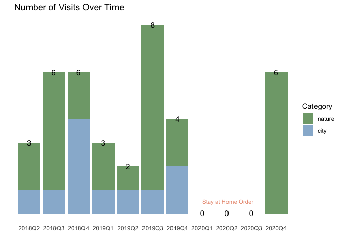

### Where did we travel?


```{=html}
<div id="htmlwidget-d8839d265acb20512c8a" style="width:672px;height:480px;" class="leaflet html-widget"></div>
<script type="application/json" data-for="htmlwidget-d8839d265acb20512c8a">{"x":{"options":{"crs":{"crsClass":"L.CRS.EPSG3857","code":null,"proj4def":null,"projectedBounds":null,"options":{}}},"calls":[{"method":"addTiles","args":["//{s}.tile.openstreetmap.org/{z}/{x}/{y}.png",null,null,{"minZoom":0,"maxZoom":18,"tileSize":256,"subdomains":"abc","errorTileUrl":"","tms":false,"noWrap":false,"zoomOffset":0,"zoomReverse":false,"opacity":1,"zIndex":1,"detectRetina":false,"attribution":"&copy; <a href=\"http://openstreetmap.org\">OpenStreetMap<\/a> contributors, <a href=\"http://creativecommons.org/licenses/by-sa/2.0/\">CC-BY-SA<\/a>"}]},{"method":"addMarkers","args":[[37.0176,37.54815,37.25229,37.80798,38.94155,37.17284,44.44827,43.79075,37.89701,37.87237,34.0591,36.60084,36.169724,37.514682,37.418915,37.750743,36.492061,36.555262,37.864509,32.716698,42.868964,40.497894,37.823387,38.313062,36.101988,36.883607,36.905268,36.492052,33.806538,34.043018,34.005823,47.60507344,41.37345676,39.24787302,38.52471332,37.92932863,37.56201121,36.84149176],[-122.00263,-121.96534,-122.04159,-122.41778,-119.97541,-122.22142,-110.70969,-110.71346,-122.58105,-122.25928,-118.21636,-121.896,-115.159113,-121.831273,-121.925867,-122.203046,-121.180559,-121.922981,-119.524965,-117.160079,-122.183115,-121.419355,-122.478489,-122.288434,-112.10732,-111.519092,-111.40509,-121.18066,-115.848083,-118.267258,-119.7941,-122.3331459,-123.3871596,-108.4971213,-108.6193655,-111.2842881,-112.1888948,-116.4429914],{"iconUrl":{"data":["https://raw.githubusercontent.com/nealxun/TravelPlaces/master/national-park-map-icons.png","https://raw.githubusercontent.com/nealxun/TravelPlaces/master/city_icon.png"],"index":[0,0,1,1,0,0,0,0,0,1,1,0,1,0,1,1,0,0,0,1,0,0,1,0,0,0,0,0,0,1,0,1,0,0,0,0,0,0]},"iconWidth":24,"iconHeight":30},null,null,{"interactive":true,"draggable":false,"keyboard":true,"title":"","alt":"","zIndexOffset":0,"opacity":1,"riseOnHover":false,"riseOffset":250},["<html> <head> <style> #popup { font-family: Arial, Helvetica, sans-serif; width: 100%; border-collapse: collapse; }   div.scrollableContainer {   max-height: 2000px;   max-width: 2000px; \twidth: 300px; \theight: 100%px;   overflow-y: hidden;   overflow-x: hidden;   margin: 0px;   padding: 0 0 0 0;   background: transparent; }   div::-webkit-scrollbar {   width: 5px;   height: 5px; } div::-webkit-scrollbar-button {   width: 0px;   height: 0px; } div::-webkit-scrollbar-thumb {   background: #666666;   border: 0px none #ffffff;   border-radius: 0px; } div::-webkit-scrollbar-thumb:hover {   background: #333333; } div::-webkit-scrollbar-thumb:active {   background: #333333; } div::-webkit-scrollbar-track {   background: #e1e1e1;   border: 0px none #ffffff;   border-radius: 50px; } div::-webkit-scrollbar-track:hover {   background: #e1e1e1; } div::-webkit-scrollbar-track:active {   background: #e1e1e1; } div::-webkit-scrollbar-corner {   background: transparent; }  .leaflet-popup { \tposition: absolute; \ttext-align: center; }  .leaflet-popup-content { \tmargin: 0px 0px 0px 0px; \twidth: 300px; \theight: 100%px; }  .leaflet-popup-content-wrapper { \tbackground: #ffffff; //#4c4c4c; \tbox-shadow: 0 3px 14px rgba(0,0,0,0.4); \twidth: 300px; \theight: 100%px; \tpadding: 0px; \ttext-align: left; \t-webkit-border-radius: 2px; \t        border-radius: 2px; }   .leaflet-popup-content-wrapper.leaflet-popup-content { \tmargin: 0px 0px 0px 0px; \twidth: 300px; \theight: 100%px; }   .leaflet-popup-content p { \tmargin: 0px 0; }  .leaflet-popup-tip-container { \twidth: 40px; \theight: 20px; \tposition: absolute; \tleft: 50%; \tmargin-left: -20px; \toverflow: hidden; \tpointer-events: none; }  .leaflet-popup-tip { \twidth: 15px; \theight: 15px; \tpadding: 1px;  \tmargin: -10px auto 0;  \t-webkit-transform: rotate(45deg); \t   -moz-transform: rotate(45deg); \t    -ms-transform: rotate(45deg); \t     -o-transform: rotate(45deg); \t        transform: rotate(45deg); }   .leaflet-popup-tip { \tbackground: #ffffff; //#4c4c4c; \tbox-shadow: 0 3px 14px rgba(0,0,0,0.4);  }  .leaflet-container a.leaflet-popup-close-button { \tposition: absolute; \ttop: 0; \tright: -20px; \tpadding: 3px 0px 0 0; \ttext-align: center; \twidth: 18px; \theight: 14px; \tfont: 16px/14px Tahoma, Verdana, sans-serif; \tcolor: #c3c3c3; \ttext-decoration: none; \tfont-weight: bold; \tbackground: transparent; \t}  .leaflet-container a.leaflet-popup-close-button:hover { \tcolor: #999; \t}  .leaflet-popup-scrolled { \tborder-bottom: 1px solid #ddd; \tborder-top: 1px solid #ddd; \t}   <\/style> <\/head> <body>  <div class=\"scrollableContainer\"> <table class=\"popup scrollable\" id=\"popup\">  <image src='https://nealxun.github.io/Travel_Places/Pictures/001_Mystery_Spot.jpg' width=300 height=100%>  <\/table> <\/div> <\/body> <\/html>","<html> <head> <style> #popup { font-family: Arial, Helvetica, sans-serif; width: 100%; border-collapse: collapse; }   div.scrollableContainer {   max-height: 2000px;   max-width: 2000px; \twidth: 300px; \theight: 100%px;   overflow-y: hidden;   overflow-x: hidden;   margin: 0px;   padding: 0 0 0 0;   background: transparent; }   div::-webkit-scrollbar {   width: 5px;   height: 5px; } div::-webkit-scrollbar-button {   width: 0px;   height: 0px; } div::-webkit-scrollbar-thumb {   background: #666666;   border: 0px none #ffffff;   border-radius: 0px; } div::-webkit-scrollbar-thumb:hover {   background: #333333; } div::-webkit-scrollbar-thumb:active {   background: #333333; } div::-webkit-scrollbar-track {   background: #e1e1e1;   border: 0px none #ffffff;   border-radius: 50px; } div::-webkit-scrollbar-track:hover {   background: #e1e1e1; } div::-webkit-scrollbar-track:active {   background: #e1e1e1; } div::-webkit-scrollbar-corner {   background: transparent; }  .leaflet-popup { \tposition: absolute; \ttext-align: center; }  .leaflet-popup-content { \tmargin: 0px 0px 0px 0px; \twidth: 300px; \theight: 100%px; }  .leaflet-popup-content-wrapper { \tbackground: #ffffff; //#4c4c4c; \tbox-shadow: 0 3px 14px rgba(0,0,0,0.4); \twidth: 300px; \theight: 100%px; \tpadding: 0px; \ttext-align: left; \t-webkit-border-radius: 2px; \t        border-radius: 2px; }   .leaflet-popup-content-wrapper.leaflet-popup-content { \tmargin: 0px 0px 0px 0px; \twidth: 300px; \theight: 100%px; }   .leaflet-popup-content p { \tmargin: 0px 0; }  .leaflet-popup-tip-container { \twidth: 40px; \theight: 20px; \tposition: absolute; \tleft: 50%; \tmargin-left: -20px; \toverflow: hidden; \tpointer-events: none; }  .leaflet-popup-tip { \twidth: 15px; \theight: 15px; \tpadding: 1px;  \tmargin: -10px auto 0;  \t-webkit-transform: rotate(45deg); \t   -moz-transform: rotate(45deg); \t    -ms-transform: rotate(45deg); \t     -o-transform: rotate(45deg); \t        transform: rotate(45deg); }   .leaflet-popup-tip { \tbackground: #ffffff; //#4c4c4c; \tbox-shadow: 0 3px 14px rgba(0,0,0,0.4);  }  .leaflet-container a.leaflet-popup-close-button { \tposition: absolute; \ttop: 0; \tright: -20px; \tpadding: 3px 0px 0 0; \ttext-align: center; \twidth: 18px; \theight: 14px; \tfont: 16px/14px Tahoma, Verdana, sans-serif; \tcolor: #c3c3c3; \ttext-decoration: none; \tfont-weight: bold; \tbackground: transparent; \t}  .leaflet-container a.leaflet-popup-close-button:hover { \tcolor: #999; \t}  .leaflet-popup-scrolled { \tborder-bottom: 1px solid #ddd; \tborder-top: 1px solid #ddd; \t}   <\/style> <\/head> <body>  <div class=\"scrollableContainer\"> <table class=\"popup scrollable\" id=\"popup\">  <image src='https://nealxun.github.io/Travel_Places/Pictures/002_Central_Park.jpg' width=300 height=100%>  <\/table> <\/div> <\/body> <\/html>","<html> <head> <style> #popup { font-family: Arial, Helvetica, sans-serif; width: 100%; border-collapse: collapse; }   div.scrollableContainer {   max-height: 2000px;   max-width: 2000px; \twidth: 300px; \theight: 100%px;   overflow-y: hidden;   overflow-x: hidden;   margin: 0px;   padding: 0 0 0 0;   background: transparent; }   div::-webkit-scrollbar {   width: 5px;   height: 5px; } div::-webkit-scrollbar-button {   width: 0px;   height: 0px; } div::-webkit-scrollbar-thumb {   background: #666666;   border: 0px none #ffffff;   border-radius: 0px; } div::-webkit-scrollbar-thumb:hover {   background: #333333; } div::-webkit-scrollbar-thumb:active {   background: #333333; } div::-webkit-scrollbar-track {   background: #e1e1e1;   border: 0px none #ffffff;   border-radius: 50px; } div::-webkit-scrollbar-track:hover {   background: #e1e1e1; } div::-webkit-scrollbar-track:active {   background: #e1e1e1; } div::-webkit-scrollbar-corner {   background: transparent; }  .leaflet-popup { \tposition: absolute; \ttext-align: center; }  .leaflet-popup-content { \tmargin: 0px 0px 0px 0px; \twidth: 300px; \theight: 100%px; }  .leaflet-popup-content-wrapper { \tbackground: #ffffff; //#4c4c4c; \tbox-shadow: 0 3px 14px rgba(0,0,0,0.4); \twidth: 300px; \theight: 100%px; \tpadding: 0px; \ttext-align: left; \t-webkit-border-radius: 2px; \t        border-radius: 2px; }   .leaflet-popup-content-wrapper.leaflet-popup-content { \tmargin: 0px 0px 0px 0px; \twidth: 300px; \theight: 100%px; }   .leaflet-popup-content p { \tmargin: 0px 0; }  .leaflet-popup-tip-container { \twidth: 40px; \theight: 20px; \tposition: absolute; \tleft: 50%; \tmargin-left: -20px; \toverflow: hidden; \tpointer-events: none; }  .leaflet-popup-tip { \twidth: 15px; \theight: 15px; \tpadding: 1px;  \tmargin: -10px auto 0;  \t-webkit-transform: rotate(45deg); \t   -moz-transform: rotate(45deg); \t    -ms-transform: rotate(45deg); \t     -o-transform: rotate(45deg); \t        transform: rotate(45deg); }   .leaflet-popup-tip { \tbackground: #ffffff; //#4c4c4c; \tbox-shadow: 0 3px 14px rgba(0,0,0,0.4);  }  .leaflet-container a.leaflet-popup-close-button { \tposition: absolute; \ttop: 0; \tright: -20px; \tpadding: 3px 0px 0 0; \ttext-align: center; \twidth: 18px; \theight: 14px; \tfont: 16px/14px Tahoma, Verdana, sans-serif; \tcolor: #c3c3c3; \ttext-decoration: none; \tfont-weight: bold; \tbackground: transparent; \t}  .leaflet-container a.leaflet-popup-close-button:hover { \tcolor: #999; \t}  .leaflet-popup-scrolled { \tborder-bottom: 1px solid #ddd; \tborder-top: 1px solid #ddd; \t}   <\/style> <\/head> <body>  <div class=\"scrollableContainer\"> <table class=\"popup scrollable\" id=\"popup\">  <image src='https://nealxun.github.io/Travel_Places/Pictures/003_Hakone_Garden.jpg' width=300 height=100%>  <\/table> <\/div> <\/body> <\/html>","<html> <head> <style> #popup { font-family: Arial, Helvetica, sans-serif; width: 100%; border-collapse: collapse; }   div.scrollableContainer {   max-height: 2000px;   max-width: 2000px; \twidth: 300px; \theight: 100%px;   overflow-y: hidden;   overflow-x: hidden;   margin: 0px;   padding: 0 0 0 0;   background: transparent; }   div::-webkit-scrollbar {   width: 5px;   height: 5px; } div::-webkit-scrollbar-button {   width: 0px;   height: 0px; } div::-webkit-scrollbar-thumb {   background: #666666;   border: 0px none #ffffff;   border-radius: 0px; } div::-webkit-scrollbar-thumb:hover {   background: #333333; } div::-webkit-scrollbar-thumb:active {   background: #333333; } div::-webkit-scrollbar-track {   background: #e1e1e1;   border: 0px none #ffffff;   border-radius: 50px; } div::-webkit-scrollbar-track:hover {   background: #e1e1e1; } div::-webkit-scrollbar-track:active {   background: #e1e1e1; } div::-webkit-scrollbar-corner {   background: transparent; }  .leaflet-popup { \tposition: absolute; \ttext-align: center; }  .leaflet-popup-content { \tmargin: 0px 0px 0px 0px; \twidth: 300px; \theight: 100%px; }  .leaflet-popup-content-wrapper { \tbackground: #ffffff; //#4c4c4c; \tbox-shadow: 0 3px 14px rgba(0,0,0,0.4); \twidth: 300px; \theight: 100%px; \tpadding: 0px; \ttext-align: left; \t-webkit-border-radius: 2px; \t        border-radius: 2px; }   .leaflet-popup-content-wrapper.leaflet-popup-content { \tmargin: 0px 0px 0px 0px; \twidth: 300px; \theight: 100%px; }   .leaflet-popup-content p { \tmargin: 0px 0; }  .leaflet-popup-tip-container { \twidth: 40px; \theight: 20px; \tposition: absolute; \tleft: 50%; \tmargin-left: -20px; \toverflow: hidden; \tpointer-events: none; }  .leaflet-popup-tip { \twidth: 15px; \theight: 15px; \tpadding: 1px;  \tmargin: -10px auto 0;  \t-webkit-transform: rotate(45deg); \t   -moz-transform: rotate(45deg); \t    -ms-transform: rotate(45deg); \t     -o-transform: rotate(45deg); \t        transform: rotate(45deg); }   .leaflet-popup-tip { \tbackground: #ffffff; //#4c4c4c; \tbox-shadow: 0 3px 14px rgba(0,0,0,0.4);  }  .leaflet-container a.leaflet-popup-close-button { \tposition: absolute; \ttop: 0; \tright: -20px; \tpadding: 3px 0px 0 0; \ttext-align: center; \twidth: 18px; \theight: 14px; \tfont: 16px/14px Tahoma, Verdana, sans-serif; \tcolor: #c3c3c3; \ttext-decoration: none; \tfont-weight: bold; \tbackground: transparent; \t}  .leaflet-container a.leaflet-popup-close-button:hover { \tcolor: #999; \t}  .leaflet-popup-scrolled { \tborder-bottom: 1px solid #ddd; \tborder-top: 1px solid #ddd; \t}   <\/style> <\/head> <body>  <div class=\"scrollableContainer\"> <table class=\"popup scrollable\" id=\"popup\">  <image src='https://nealxun.github.io/Travel_Places/Pictures/004_San Francisco.jpg' width=300 height=100%>  <\/table> <\/div> <\/body> <\/html>","<html> <head> <style> #popup { font-family: Arial, Helvetica, sans-serif; width: 100%; border-collapse: collapse; }   div.scrollableContainer {   max-height: 2000px;   max-width: 2000px; \twidth: 300px; \theight: 100%px;   overflow-y: hidden;   overflow-x: hidden;   margin: 0px;   padding: 0 0 0 0;   background: transparent; }   div::-webkit-scrollbar {   width: 5px;   height: 5px; } div::-webkit-scrollbar-button {   width: 0px;   height: 0px; } div::-webkit-scrollbar-thumb {   background: #666666;   border: 0px none #ffffff;   border-radius: 0px; } div::-webkit-scrollbar-thumb:hover {   background: #333333; } div::-webkit-scrollbar-thumb:active {   background: #333333; } div::-webkit-scrollbar-track {   background: #e1e1e1;   border: 0px none #ffffff;   border-radius: 50px; } div::-webkit-scrollbar-track:hover {   background: #e1e1e1; } div::-webkit-scrollbar-track:active {   background: #e1e1e1; } div::-webkit-scrollbar-corner {   background: transparent; }  .leaflet-popup { \tposition: absolute; \ttext-align: center; }  .leaflet-popup-content { \tmargin: 0px 0px 0px 0px; \twidth: 300px; \theight: 100%px; }  .leaflet-popup-content-wrapper { \tbackground: #ffffff; //#4c4c4c; \tbox-shadow: 0 3px 14px rgba(0,0,0,0.4); \twidth: 300px; \theight: 100%px; \tpadding: 0px; \ttext-align: left; \t-webkit-border-radius: 2px; \t        border-radius: 2px; }   .leaflet-popup-content-wrapper.leaflet-popup-content { \tmargin: 0px 0px 0px 0px; \twidth: 300px; \theight: 100%px; }   .leaflet-popup-content p { \tmargin: 0px 0; }  .leaflet-popup-tip-container { \twidth: 40px; \theight: 20px; \tposition: absolute; \tleft: 50%; \tmargin-left: -20px; \toverflow: hidden; \tpointer-events: none; }  .leaflet-popup-tip { \twidth: 15px; \theight: 15px; \tpadding: 1px;  \tmargin: -10px auto 0;  \t-webkit-transform: rotate(45deg); \t   -moz-transform: rotate(45deg); \t    -ms-transform: rotate(45deg); \t     -o-transform: rotate(45deg); \t        transform: rotate(45deg); }   .leaflet-popup-tip { \tbackground: #ffffff; //#4c4c4c; \tbox-shadow: 0 3px 14px rgba(0,0,0,0.4);  }  .leaflet-container a.leaflet-popup-close-button { \tposition: absolute; \ttop: 0; \tright: -20px; \tpadding: 3px 0px 0 0; \ttext-align: center; \twidth: 18px; \theight: 14px; \tfont: 16px/14px Tahoma, Verdana, sans-serif; \tcolor: #c3c3c3; \ttext-decoration: none; \tfont-weight: bold; \tbackground: transparent; \t}  .leaflet-container a.leaflet-popup-close-button:hover { \tcolor: #999; \t}  .leaflet-popup-scrolled { \tborder-bottom: 1px solid #ddd; \tborder-top: 1px solid #ddd; \t}   <\/style> <\/head> <body>  <div class=\"scrollableContainer\"> <table class=\"popup scrollable\" id=\"popup\">  <image src='https://nealxun.github.io/Travel_Places/Pictures/005_South_Lake_Tahoe.jpg' width=300 height=100%>  <\/table> <\/div> <\/body> <\/html>","<html> <head> <style> #popup { font-family: Arial, Helvetica, sans-serif; width: 100%; border-collapse: collapse; }   div.scrollableContainer {   max-height: 2000px;   max-width: 2000px; \twidth: 300px; \theight: 100%px;   overflow-y: hidden;   overflow-x: hidden;   margin: 0px;   padding: 0 0 0 0;   background: transparent; }   div::-webkit-scrollbar {   width: 5px;   height: 5px; } div::-webkit-scrollbar-button {   width: 0px;   height: 0px; } div::-webkit-scrollbar-thumb {   background: #666666;   border: 0px none #ffffff;   border-radius: 0px; } div::-webkit-scrollbar-thumb:hover {   background: #333333; } div::-webkit-scrollbar-thumb:active {   background: #333333; } div::-webkit-scrollbar-track {   background: #e1e1e1;   border: 0px none #ffffff;   border-radius: 50px; } div::-webkit-scrollbar-track:hover {   background: #e1e1e1; } div::-webkit-scrollbar-track:active {   background: #e1e1e1; } div::-webkit-scrollbar-corner {   background: transparent; }  .leaflet-popup { \tposition: absolute; \ttext-align: center; }  .leaflet-popup-content { \tmargin: 0px 0px 0px 0px; \twidth: 300px; \theight: 100%px; }  .leaflet-popup-content-wrapper { \tbackground: #ffffff; //#4c4c4c; \tbox-shadow: 0 3px 14px rgba(0,0,0,0.4); \twidth: 300px; \theight: 100%px; \tpadding: 0px; \ttext-align: left; \t-webkit-border-radius: 2px; \t        border-radius: 2px; }   .leaflet-popup-content-wrapper.leaflet-popup-content { \tmargin: 0px 0px 0px 0px; \twidth: 300px; \theight: 100%px; }   .leaflet-popup-content p { \tmargin: 0px 0; }  .leaflet-popup-tip-container { \twidth: 40px; \theight: 20px; \tposition: absolute; \tleft: 50%; \tmargin-left: -20px; \toverflow: hidden; \tpointer-events: none; }  .leaflet-popup-tip { \twidth: 15px; \theight: 15px; \tpadding: 1px;  \tmargin: -10px auto 0;  \t-webkit-transform: rotate(45deg); \t   -moz-transform: rotate(45deg); \t    -ms-transform: rotate(45deg); \t     -o-transform: rotate(45deg); \t        transform: rotate(45deg); }   .leaflet-popup-tip { \tbackground: #ffffff; //#4c4c4c; \tbox-shadow: 0 3px 14px rgba(0,0,0,0.4);  }  .leaflet-container a.leaflet-popup-close-button { \tposition: absolute; \ttop: 0; \tright: -20px; \tpadding: 3px 0px 0 0; \ttext-align: center; \twidth: 18px; \theight: 14px; \tfont: 16px/14px Tahoma, Verdana, sans-serif; \tcolor: #c3c3c3; \ttext-decoration: none; \tfont-weight: bold; \tbackground: transparent; \t}  .leaflet-container a.leaflet-popup-close-button:hover { \tcolor: #999; \t}  .leaflet-popup-scrolled { \tborder-bottom: 1px solid #ddd; \tborder-top: 1px solid #ddd; \t}   <\/style> <\/head> <body>  <div class=\"scrollableContainer\"> <table class=\"popup scrollable\" id=\"popup\">  <image src='https://nealxun.github.io/Travel_Places/Pictures/006_Big_Basin_Redwood_State_Park.jpg' width=300 height=100%>  <\/table> <\/div> <\/body> <\/html>","<html> <head> <style> #popup { font-family: Arial, Helvetica, sans-serif; width: 100%; border-collapse: collapse; }   div.scrollableContainer {   max-height: 2000px;   max-width: 2000px; \twidth: 300px; \theight: 100%px;   overflow-y: hidden;   overflow-x: hidden;   margin: 0px;   padding: 0 0 0 0;   background: transparent; }   div::-webkit-scrollbar {   width: 5px;   height: 5px; } div::-webkit-scrollbar-button {   width: 0px;   height: 0px; } div::-webkit-scrollbar-thumb {   background: #666666;   border: 0px none #ffffff;   border-radius: 0px; } div::-webkit-scrollbar-thumb:hover {   background: #333333; } div::-webkit-scrollbar-thumb:active {   background: #333333; } div::-webkit-scrollbar-track {   background: #e1e1e1;   border: 0px none #ffffff;   border-radius: 50px; } div::-webkit-scrollbar-track:hover {   background: #e1e1e1; } div::-webkit-scrollbar-track:active {   background: #e1e1e1; } div::-webkit-scrollbar-corner {   background: transparent; }  .leaflet-popup { \tposition: absolute; \ttext-align: center; }  .leaflet-popup-content { \tmargin: 0px 0px 0px 0px; \twidth: 300px; \theight: 100%px; }  .leaflet-popup-content-wrapper { \tbackground: #ffffff; //#4c4c4c; \tbox-shadow: 0 3px 14px rgba(0,0,0,0.4); \twidth: 300px; \theight: 100%px; \tpadding: 0px; \ttext-align: left; \t-webkit-border-radius: 2px; \t        border-radius: 2px; }   .leaflet-popup-content-wrapper.leaflet-popup-content { \tmargin: 0px 0px 0px 0px; \twidth: 300px; \theight: 100%px; }   .leaflet-popup-content p { \tmargin: 0px 0; }  .leaflet-popup-tip-container { \twidth: 40px; \theight: 20px; \tposition: absolute; \tleft: 50%; \tmargin-left: -20px; \toverflow: hidden; \tpointer-events: none; }  .leaflet-popup-tip { \twidth: 15px; \theight: 15px; \tpadding: 1px;  \tmargin: -10px auto 0;  \t-webkit-transform: rotate(45deg); \t   -moz-transform: rotate(45deg); \t    -ms-transform: rotate(45deg); \t     -o-transform: rotate(45deg); \t        transform: rotate(45deg); }   .leaflet-popup-tip { \tbackground: #ffffff; //#4c4c4c; \tbox-shadow: 0 3px 14px rgba(0,0,0,0.4);  }  .leaflet-container a.leaflet-popup-close-button { \tposition: absolute; \ttop: 0; \tright: -20px; \tpadding: 3px 0px 0 0; \ttext-align: center; \twidth: 18px; \theight: 14px; \tfont: 16px/14px Tahoma, Verdana, sans-serif; \tcolor: #c3c3c3; \ttext-decoration: none; \tfont-weight: bold; \tbackground: transparent; \t}  .leaflet-container a.leaflet-popup-close-button:hover { \tcolor: #999; \t}  .leaflet-popup-scrolled { \tborder-bottom: 1px solid #ddd; \tborder-top: 1px solid #ddd; \t}   <\/style> <\/head> <body>  <div class=\"scrollableContainer\"> <table class=\"popup scrollable\" id=\"popup\">  <image src='https://nealxun.github.io/Travel_Places/Pictures/007_Yellow_Stone_National_Park.jpg' width=300 height=100%>  <\/table> <\/div> <\/body> <\/html>","<html> <head> <style> #popup { font-family: Arial, Helvetica, sans-serif; width: 100%; border-collapse: collapse; }   div.scrollableContainer {   max-height: 2000px;   max-width: 2000px; \twidth: 300px; \theight: 100%px;   overflow-y: hidden;   overflow-x: hidden;   margin: 0px;   padding: 0 0 0 0;   background: transparent; }   div::-webkit-scrollbar {   width: 5px;   height: 5px; } div::-webkit-scrollbar-button {   width: 0px;   height: 0px; } div::-webkit-scrollbar-thumb {   background: #666666;   border: 0px none #ffffff;   border-radius: 0px; } div::-webkit-scrollbar-thumb:hover {   background: #333333; } div::-webkit-scrollbar-thumb:active {   background: #333333; } div::-webkit-scrollbar-track {   background: #e1e1e1;   border: 0px none #ffffff;   border-radius: 50px; } div::-webkit-scrollbar-track:hover {   background: #e1e1e1; } div::-webkit-scrollbar-track:active {   background: #e1e1e1; } div::-webkit-scrollbar-corner {   background: transparent; }  .leaflet-popup { \tposition: absolute; \ttext-align: center; }  .leaflet-popup-content { \tmargin: 0px 0px 0px 0px; \twidth: 300px; \theight: 100%px; }  .leaflet-popup-content-wrapper { \tbackground: #ffffff; //#4c4c4c; \tbox-shadow: 0 3px 14px rgba(0,0,0,0.4); \twidth: 300px; \theight: 100%px; \tpadding: 0px; \ttext-align: left; \t-webkit-border-radius: 2px; \t        border-radius: 2px; }   .leaflet-popup-content-wrapper.leaflet-popup-content { \tmargin: 0px 0px 0px 0px; \twidth: 300px; \theight: 100%px; }   .leaflet-popup-content p { \tmargin: 0px 0; }  .leaflet-popup-tip-container { \twidth: 40px; \theight: 20px; \tposition: absolute; \tleft: 50%; \tmargin-left: -20px; \toverflow: hidden; \tpointer-events: none; }  .leaflet-popup-tip { \twidth: 15px; \theight: 15px; \tpadding: 1px;  \tmargin: -10px auto 0;  \t-webkit-transform: rotate(45deg); \t   -moz-transform: rotate(45deg); \t    -ms-transform: rotate(45deg); \t     -o-transform: rotate(45deg); \t        transform: rotate(45deg); }   .leaflet-popup-tip { \tbackground: #ffffff; //#4c4c4c; \tbox-shadow: 0 3px 14px rgba(0,0,0,0.4);  }  .leaflet-container a.leaflet-popup-close-button { \tposition: absolute; \ttop: 0; \tright: -20px; \tpadding: 3px 0px 0 0; \ttext-align: center; \twidth: 18px; \theight: 14px; \tfont: 16px/14px Tahoma, Verdana, sans-serif; \tcolor: #c3c3c3; \ttext-decoration: none; \tfont-weight: bold; \tbackground: transparent; \t}  .leaflet-container a.leaflet-popup-close-button:hover { \tcolor: #999; \t}  .leaflet-popup-scrolled { \tborder-bottom: 1px solid #ddd; \tborder-top: 1px solid #ddd; \t}   <\/style> <\/head> <body>  <div class=\"scrollableContainer\"> <table class=\"popup scrollable\" id=\"popup\">  <image src='https://nealxun.github.io/Travel_Places/Pictures/008_Grand_Teton_National_Park.jpg' width=300 height=100%>  <\/table> <\/div> <\/body> <\/html>","<html> <head> <style> #popup { font-family: Arial, Helvetica, sans-serif; width: 100%; border-collapse: collapse; }   div.scrollableContainer {   max-height: 2000px;   max-width: 2000px; \twidth: 300px; \theight: 100%px;   overflow-y: hidden;   overflow-x: hidden;   margin: 0px;   padding: 0 0 0 0;   background: transparent; }   div::-webkit-scrollbar {   width: 5px;   height: 5px; } div::-webkit-scrollbar-button {   width: 0px;   height: 0px; } div::-webkit-scrollbar-thumb {   background: #666666;   border: 0px none #ffffff;   border-radius: 0px; } div::-webkit-scrollbar-thumb:hover {   background: #333333; } div::-webkit-scrollbar-thumb:active {   background: #333333; } div::-webkit-scrollbar-track {   background: #e1e1e1;   border: 0px none #ffffff;   border-radius: 50px; } div::-webkit-scrollbar-track:hover {   background: #e1e1e1; } div::-webkit-scrollbar-track:active {   background: #e1e1e1; } div::-webkit-scrollbar-corner {   background: transparent; }  .leaflet-popup { \tposition: absolute; \ttext-align: center; }  .leaflet-popup-content { \tmargin: 0px 0px 0px 0px; \twidth: 300px; \theight: 100%px; }  .leaflet-popup-content-wrapper { \tbackground: #ffffff; //#4c4c4c; \tbox-shadow: 0 3px 14px rgba(0,0,0,0.4); \twidth: 300px; \theight: 100%px; \tpadding: 0px; \ttext-align: left; \t-webkit-border-radius: 2px; \t        border-radius: 2px; }   .leaflet-popup-content-wrapper.leaflet-popup-content { \tmargin: 0px 0px 0px 0px; \twidth: 300px; \theight: 100%px; }   .leaflet-popup-content p { \tmargin: 0px 0; }  .leaflet-popup-tip-container { \twidth: 40px; \theight: 20px; \tposition: absolute; \tleft: 50%; \tmargin-left: -20px; \toverflow: hidden; \tpointer-events: none; }  .leaflet-popup-tip { \twidth: 15px; \theight: 15px; \tpadding: 1px;  \tmargin: -10px auto 0;  \t-webkit-transform: rotate(45deg); \t   -moz-transform: rotate(45deg); \t    -ms-transform: rotate(45deg); \t     -o-transform: rotate(45deg); \t        transform: rotate(45deg); }   .leaflet-popup-tip { \tbackground: #ffffff; //#4c4c4c; \tbox-shadow: 0 3px 14px rgba(0,0,0,0.4);  }  .leaflet-container a.leaflet-popup-close-button { \tposition: absolute; \ttop: 0; \tright: -20px; \tpadding: 3px 0px 0 0; \ttext-align: center; \twidth: 18px; \theight: 14px; \tfont: 16px/14px Tahoma, Verdana, sans-serif; \tcolor: #c3c3c3; \ttext-decoration: none; \tfont-weight: bold; \tbackground: transparent; \t}  .leaflet-container a.leaflet-popup-close-button:hover { \tcolor: #999; \t}  .leaflet-popup-scrolled { \tborder-bottom: 1px solid #ddd; \tborder-top: 1px solid #ddd; \t}   <\/style> <\/head> <body>  <div class=\"scrollableContainer\"> <table class=\"popup scrollable\" id=\"popup\">  <image src='https://nealxun.github.io/Travel_Places/Pictures/009_Muri_Wood_State_Park.jpg' width=300 height=100%>  <\/table> <\/div> <\/body> <\/html>","<html> <head> <style> #popup { font-family: Arial, Helvetica, sans-serif; width: 100%; border-collapse: collapse; }   div.scrollableContainer {   max-height: 2000px;   max-width: 2000px; \twidth: 300px; \theight: 100%px;   overflow-y: hidden;   overflow-x: hidden;   margin: 0px;   padding: 0 0 0 0;   background: transparent; }   div::-webkit-scrollbar {   width: 5px;   height: 5px; } div::-webkit-scrollbar-button {   width: 0px;   height: 0px; } div::-webkit-scrollbar-thumb {   background: #666666;   border: 0px none #ffffff;   border-radius: 0px; } div::-webkit-scrollbar-thumb:hover {   background: #333333; } div::-webkit-scrollbar-thumb:active {   background: #333333; } div::-webkit-scrollbar-track {   background: #e1e1e1;   border: 0px none #ffffff;   border-radius: 50px; } div::-webkit-scrollbar-track:hover {   background: #e1e1e1; } div::-webkit-scrollbar-track:active {   background: #e1e1e1; } div::-webkit-scrollbar-corner {   background: transparent; }  .leaflet-popup { \tposition: absolute; \ttext-align: center; }  .leaflet-popup-content { \tmargin: 0px 0px 0px 0px; \twidth: 300px; \theight: 100%px; }  .leaflet-popup-content-wrapper { \tbackground: #ffffff; //#4c4c4c; \tbox-shadow: 0 3px 14px rgba(0,0,0,0.4); \twidth: 300px; \theight: 100%px; \tpadding: 0px; \ttext-align: left; \t-webkit-border-radius: 2px; \t        border-radius: 2px; }   .leaflet-popup-content-wrapper.leaflet-popup-content { \tmargin: 0px 0px 0px 0px; \twidth: 300px; \theight: 100%px; }   .leaflet-popup-content p { \tmargin: 0px 0; }  .leaflet-popup-tip-container { \twidth: 40px; \theight: 20px; \tposition: absolute; \tleft: 50%; \tmargin-left: -20px; \toverflow: hidden; \tpointer-events: none; }  .leaflet-popup-tip { \twidth: 15px; \theight: 15px; \tpadding: 1px;  \tmargin: -10px auto 0;  \t-webkit-transform: rotate(45deg); \t   -moz-transform: rotate(45deg); \t    -ms-transform: rotate(45deg); \t     -o-transform: rotate(45deg); \t        transform: rotate(45deg); }   .leaflet-popup-tip { \tbackground: #ffffff; //#4c4c4c; \tbox-shadow: 0 3px 14px rgba(0,0,0,0.4);  }  .leaflet-container a.leaflet-popup-close-button { \tposition: absolute; \ttop: 0; \tright: -20px; \tpadding: 3px 0px 0 0; \ttext-align: center; \twidth: 18px; \theight: 14px; \tfont: 16px/14px Tahoma, Verdana, sans-serif; \tcolor: #c3c3c3; \ttext-decoration: none; \tfont-weight: bold; \tbackground: transparent; \t}  .leaflet-container a.leaflet-popup-close-button:hover { \tcolor: #999; \t}  .leaflet-popup-scrolled { \tborder-bottom: 1px solid #ddd; \tborder-top: 1px solid #ddd; \t}   <\/style> <\/head> <body>  <div class=\"scrollableContainer\"> <table class=\"popup scrollable\" id=\"popup\">  <image src='https://nealxun.github.io/Travel_Places/Pictures/010_UC_Berkley.jpg' width=300 height=100%>  <\/table> <\/div> <\/body> <\/html>","<html> <head> <style> #popup { font-family: Arial, Helvetica, sans-serif; width: 100%; border-collapse: collapse; }   div.scrollableContainer {   max-height: 2000px;   max-width: 2000px; \twidth: 300px; \theight: 100%px;   overflow-y: hidden;   overflow-x: hidden;   margin: 0px;   padding: 0 0 0 0;   background: transparent; }   div::-webkit-scrollbar {   width: 5px;   height: 5px; } div::-webkit-scrollbar-button {   width: 0px;   height: 0px; } div::-webkit-scrollbar-thumb {   background: #666666;   border: 0px none #ffffff;   border-radius: 0px; } div::-webkit-scrollbar-thumb:hover {   background: #333333; } div::-webkit-scrollbar-thumb:active {   background: #333333; } div::-webkit-scrollbar-track {   background: #e1e1e1;   border: 0px none #ffffff;   border-radius: 50px; } div::-webkit-scrollbar-track:hover {   background: #e1e1e1; } div::-webkit-scrollbar-track:active {   background: #e1e1e1; } div::-webkit-scrollbar-corner {   background: transparent; }  .leaflet-popup { \tposition: absolute; \ttext-align: center; }  .leaflet-popup-content { \tmargin: 0px 0px 0px 0px; \twidth: 300px; \theight: 100%px; }  .leaflet-popup-content-wrapper { \tbackground: #ffffff; //#4c4c4c; \tbox-shadow: 0 3px 14px rgba(0,0,0,0.4); \twidth: 300px; \theight: 100%px; \tpadding: 0px; \ttext-align: left; \t-webkit-border-radius: 2px; \t        border-radius: 2px; }   .leaflet-popup-content-wrapper.leaflet-popup-content { \tmargin: 0px 0px 0px 0px; \twidth: 300px; \theight: 100%px; }   .leaflet-popup-content p { \tmargin: 0px 0; }  .leaflet-popup-tip-container { \twidth: 40px; \theight: 20px; \tposition: absolute; \tleft: 50%; \tmargin-left: -20px; \toverflow: hidden; \tpointer-events: none; }  .leaflet-popup-tip { \twidth: 15px; \theight: 15px; \tpadding: 1px;  \tmargin: -10px auto 0;  \t-webkit-transform: rotate(45deg); \t   -moz-transform: rotate(45deg); \t    -ms-transform: rotate(45deg); \t     -o-transform: rotate(45deg); \t        transform: rotate(45deg); }   .leaflet-popup-tip { \tbackground: #ffffff; //#4c4c4c; \tbox-shadow: 0 3px 14px rgba(0,0,0,0.4);  }  .leaflet-container a.leaflet-popup-close-button { \tposition: absolute; \ttop: 0; \tright: -20px; \tpadding: 3px 0px 0 0; \ttext-align: center; \twidth: 18px; \theight: 14px; \tfont: 16px/14px Tahoma, Verdana, sans-serif; \tcolor: #c3c3c3; \ttext-decoration: none; \tfont-weight: bold; \tbackground: transparent; \t}  .leaflet-container a.leaflet-popup-close-button:hover { \tcolor: #999; \t}  .leaflet-popup-scrolled { \tborder-bottom: 1px solid #ddd; \tborder-top: 1px solid #ddd; \t}   <\/style> <\/head> <body>  <div class=\"scrollableContainer\"> <table class=\"popup scrollable\" id=\"popup\">  <image src='https://nealxun.github.io/Travel_Places/Pictures/011_Los_Angeles.jpg' width=300 height=100%>  <\/table> <\/div> <\/body> <\/html>","<html> <head> <style> #popup { font-family: Arial, Helvetica, sans-serif; width: 100%; border-collapse: collapse; }   div.scrollableContainer {   max-height: 2000px;   max-width: 2000px; \twidth: 300px; \theight: 100%px;   overflow-y: hidden;   overflow-x: hidden;   margin: 0px;   padding: 0 0 0 0;   background: transparent; }   div::-webkit-scrollbar {   width: 5px;   height: 5px; } div::-webkit-scrollbar-button {   width: 0px;   height: 0px; } div::-webkit-scrollbar-thumb {   background: #666666;   border: 0px none #ffffff;   border-radius: 0px; } div::-webkit-scrollbar-thumb:hover {   background: #333333; } div::-webkit-scrollbar-thumb:active {   background: #333333; } div::-webkit-scrollbar-track {   background: #e1e1e1;   border: 0px none #ffffff;   border-radius: 50px; } div::-webkit-scrollbar-track:hover {   background: #e1e1e1; } div::-webkit-scrollbar-track:active {   background: #e1e1e1; } div::-webkit-scrollbar-corner {   background: transparent; }  .leaflet-popup { \tposition: absolute; \ttext-align: center; }  .leaflet-popup-content { \tmargin: 0px 0px 0px 0px; \twidth: 300px; \theight: 100%px; }  .leaflet-popup-content-wrapper { \tbackground: #ffffff; //#4c4c4c; \tbox-shadow: 0 3px 14px rgba(0,0,0,0.4); \twidth: 300px; \theight: 100%px; \tpadding: 0px; \ttext-align: left; \t-webkit-border-radius: 2px; \t        border-radius: 2px; }   .leaflet-popup-content-wrapper.leaflet-popup-content { \tmargin: 0px 0px 0px 0px; \twidth: 300px; \theight: 100%px; }   .leaflet-popup-content p { \tmargin: 0px 0; }  .leaflet-popup-tip-container { \twidth: 40px; \theight: 20px; \tposition: absolute; \tleft: 50%; \tmargin-left: -20px; \toverflow: hidden; \tpointer-events: none; }  .leaflet-popup-tip { \twidth: 15px; \theight: 15px; \tpadding: 1px;  \tmargin: -10px auto 0;  \t-webkit-transform: rotate(45deg); \t   -moz-transform: rotate(45deg); \t    -ms-transform: rotate(45deg); \t     -o-transform: rotate(45deg); \t        transform: rotate(45deg); }   .leaflet-popup-tip { \tbackground: #ffffff; //#4c4c4c; \tbox-shadow: 0 3px 14px rgba(0,0,0,0.4);  }  .leaflet-container a.leaflet-popup-close-button { \tposition: absolute; \ttop: 0; \tright: -20px; \tpadding: 3px 0px 0 0; \ttext-align: center; \twidth: 18px; \theight: 14px; \tfont: 16px/14px Tahoma, Verdana, sans-serif; \tcolor: #c3c3c3; \ttext-decoration: none; \tfont-weight: bold; \tbackground: transparent; \t}  .leaflet-container a.leaflet-popup-close-button:hover { \tcolor: #999; \t}  .leaflet-popup-scrolled { \tborder-bottom: 1px solid #ddd; \tborder-top: 1px solid #ddd; \t}   <\/style> <\/head> <body>  <div class=\"scrollableContainer\"> <table class=\"popup scrollable\" id=\"popup\">  <image src='https://nealxun.github.io/Travel_Places/Pictures/012_Monterey.jpg' width=300 height=100%>  <\/table> <\/div> <\/body> <\/html>","<html> <head> <style> #popup { font-family: Arial, Helvetica, sans-serif; width: 100%; border-collapse: collapse; }   div.scrollableContainer {   max-height: 2000px;   max-width: 2000px; \twidth: 300px; \theight: 100%px;   overflow-y: hidden;   overflow-x: hidden;   margin: 0px;   padding: 0 0 0 0;   background: transparent; }   div::-webkit-scrollbar {   width: 5px;   height: 5px; } div::-webkit-scrollbar-button {   width: 0px;   height: 0px; } div::-webkit-scrollbar-thumb {   background: #666666;   border: 0px none #ffffff;   border-radius: 0px; } div::-webkit-scrollbar-thumb:hover {   background: #333333; } div::-webkit-scrollbar-thumb:active {   background: #333333; } div::-webkit-scrollbar-track {   background: #e1e1e1;   border: 0px none #ffffff;   border-radius: 50px; } div::-webkit-scrollbar-track:hover {   background: #e1e1e1; } div::-webkit-scrollbar-track:active {   background: #e1e1e1; } div::-webkit-scrollbar-corner {   background: transparent; }  .leaflet-popup { \tposition: absolute; \ttext-align: center; }  .leaflet-popup-content { \tmargin: 0px 0px 0px 0px; \twidth: 300px; \theight: 100%px; }  .leaflet-popup-content-wrapper { \tbackground: #ffffff; //#4c4c4c; \tbox-shadow: 0 3px 14px rgba(0,0,0,0.4); \twidth: 300px; \theight: 100%px; \tpadding: 0px; \ttext-align: left; \t-webkit-border-radius: 2px; \t        border-radius: 2px; }   .leaflet-popup-content-wrapper.leaflet-popup-content { \tmargin: 0px 0px 0px 0px; \twidth: 300px; \theight: 100%px; }   .leaflet-popup-content p { \tmargin: 0px 0; }  .leaflet-popup-tip-container { \twidth: 40px; \theight: 20px; \tposition: absolute; \tleft: 50%; \tmargin-left: -20px; \toverflow: hidden; \tpointer-events: none; }  .leaflet-popup-tip { \twidth: 15px; \theight: 15px; \tpadding: 1px;  \tmargin: -10px auto 0;  \t-webkit-transform: rotate(45deg); \t   -moz-transform: rotate(45deg); \t    -ms-transform: rotate(45deg); \t     -o-transform: rotate(45deg); \t        transform: rotate(45deg); }   .leaflet-popup-tip { \tbackground: #ffffff; //#4c4c4c; \tbox-shadow: 0 3px 14px rgba(0,0,0,0.4);  }  .leaflet-container a.leaflet-popup-close-button { \tposition: absolute; \ttop: 0; \tright: -20px; \tpadding: 3px 0px 0 0; \ttext-align: center; \twidth: 18px; \theight: 14px; \tfont: 16px/14px Tahoma, Verdana, sans-serif; \tcolor: #c3c3c3; \ttext-decoration: none; \tfont-weight: bold; \tbackground: transparent; \t}  .leaflet-container a.leaflet-popup-close-button:hover { \tcolor: #999; \t}  .leaflet-popup-scrolled { \tborder-bottom: 1px solid #ddd; \tborder-top: 1px solid #ddd; \t}   <\/style> <\/head> <body>  <div class=\"scrollableContainer\"> <table class=\"popup scrollable\" id=\"popup\">  <image src='https://nealxun.github.io/Travel_Places/Pictures/013_LasVegas.jpg' width=300 height=100%>  <\/table> <\/div> <\/body> <\/html>","<html> <head> <style> #popup { font-family: Arial, Helvetica, sans-serif; width: 100%; border-collapse: collapse; }   div.scrollableContainer {   max-height: 2000px;   max-width: 2000px; \twidth: 300px; \theight: 100%px;   overflow-y: hidden;   overflow-x: hidden;   margin: 0px;   padding: 0 0 0 0;   background: transparent; }   div::-webkit-scrollbar {   width: 5px;   height: 5px; } div::-webkit-scrollbar-button {   width: 0px;   height: 0px; } div::-webkit-scrollbar-thumb {   background: #666666;   border: 0px none #ffffff;   border-radius: 0px; } div::-webkit-scrollbar-thumb:hover {   background: #333333; } div::-webkit-scrollbar-thumb:active {   background: #333333; } div::-webkit-scrollbar-track {   background: #e1e1e1;   border: 0px none #ffffff;   border-radius: 50px; } div::-webkit-scrollbar-track:hover {   background: #e1e1e1; } div::-webkit-scrollbar-track:active {   background: #e1e1e1; } div::-webkit-scrollbar-corner {   background: transparent; }  .leaflet-popup { \tposition: absolute; \ttext-align: center; }  .leaflet-popup-content { \tmargin: 0px 0px 0px 0px; \twidth: 300px; \theight: 100%px; }  .leaflet-popup-content-wrapper { \tbackground: #ffffff; //#4c4c4c; \tbox-shadow: 0 3px 14px rgba(0,0,0,0.4); \twidth: 300px; \theight: 100%px; \tpadding: 0px; \ttext-align: left; \t-webkit-border-radius: 2px; \t        border-radius: 2px; }   .leaflet-popup-content-wrapper.leaflet-popup-content { \tmargin: 0px 0px 0px 0px; \twidth: 300px; \theight: 100%px; }   .leaflet-popup-content p { \tmargin: 0px 0; }  .leaflet-popup-tip-container { \twidth: 40px; \theight: 20px; \tposition: absolute; \tleft: 50%; \tmargin-left: -20px; \toverflow: hidden; \tpointer-events: none; }  .leaflet-popup-tip { \twidth: 15px; \theight: 15px; \tpadding: 1px;  \tmargin: -10px auto 0;  \t-webkit-transform: rotate(45deg); \t   -moz-transform: rotate(45deg); \t    -ms-transform: rotate(45deg); \t     -o-transform: rotate(45deg); \t        transform: rotate(45deg); }   .leaflet-popup-tip { \tbackground: #ffffff; //#4c4c4c; \tbox-shadow: 0 3px 14px rgba(0,0,0,0.4);  }  .leaflet-container a.leaflet-popup-close-button { \tposition: absolute; \ttop: 0; \tright: -20px; \tpadding: 3px 0px 0 0; \ttext-align: center; \twidth: 18px; \theight: 14px; \tfont: 16px/14px Tahoma, Verdana, sans-serif; \tcolor: #c3c3c3; \ttext-decoration: none; \tfont-weight: bold; \tbackground: transparent; \t}  .leaflet-container a.leaflet-popup-close-button:hover { \tcolor: #999; \t}  .leaflet-popup-scrolled { \tborder-bottom: 1px solid #ddd; \tborder-top: 1px solid #ddd; \t}   <\/style> <\/head> <body>  <div class=\"scrollableContainer\"> <table class=\"popup scrollable\" id=\"popup\">  <image src='https://nealxun.github.io/Travel_Places/Pictures/014_Sunol_Regional_Wilderness.jpg' width=300 height=100%>  <\/table> <\/div> <\/body> <\/html>","<html> <head> <style> #popup { font-family: Arial, Helvetica, sans-serif; width: 100%; border-collapse: collapse; }   div.scrollableContainer {   max-height: 2000px;   max-width: 2000px; \twidth: 300px; \theight: 100%px;   overflow-y: hidden;   overflow-x: hidden;   margin: 0px;   padding: 0 0 0 0;   background: transparent; }   div::-webkit-scrollbar {   width: 5px;   height: 5px; } div::-webkit-scrollbar-button {   width: 0px;   height: 0px; } div::-webkit-scrollbar-thumb {   background: #666666;   border: 0px none #ffffff;   border-radius: 0px; } div::-webkit-scrollbar-thumb:hover {   background: #333333; } div::-webkit-scrollbar-thumb:active {   background: #333333; } div::-webkit-scrollbar-track {   background: #e1e1e1;   border: 0px none #ffffff;   border-radius: 50px; } div::-webkit-scrollbar-track:hover {   background: #e1e1e1; } div::-webkit-scrollbar-track:active {   background: #e1e1e1; } div::-webkit-scrollbar-corner {   background: transparent; }  .leaflet-popup { \tposition: absolute; \ttext-align: center; }  .leaflet-popup-content { \tmargin: 0px 0px 0px 0px; \twidth: 300px; \theight: 100%px; }  .leaflet-popup-content-wrapper { \tbackground: #ffffff; //#4c4c4c; \tbox-shadow: 0 3px 14px rgba(0,0,0,0.4); \twidth: 300px; \theight: 100%px; \tpadding: 0px; \ttext-align: left; \t-webkit-border-radius: 2px; \t        border-radius: 2px; }   .leaflet-popup-content-wrapper.leaflet-popup-content { \tmargin: 0px 0px 0px 0px; \twidth: 300px; \theight: 100%px; }   .leaflet-popup-content p { \tmargin: 0px 0; }  .leaflet-popup-tip-container { \twidth: 40px; \theight: 20px; \tposition: absolute; \tleft: 50%; \tmargin-left: -20px; \toverflow: hidden; \tpointer-events: none; }  .leaflet-popup-tip { \twidth: 15px; \theight: 15px; \tpadding: 1px;  \tmargin: -10px auto 0;  \t-webkit-transform: rotate(45deg); \t   -moz-transform: rotate(45deg); \t    -ms-transform: rotate(45deg); \t     -o-transform: rotate(45deg); \t        transform: rotate(45deg); }   .leaflet-popup-tip { \tbackground: #ffffff; //#4c4c4c; \tbox-shadow: 0 3px 14px rgba(0,0,0,0.4);  }  .leaflet-container a.leaflet-popup-close-button { \tposition: absolute; \ttop: 0; \tright: -20px; \tpadding: 3px 0px 0 0; \ttext-align: center; \twidth: 18px; \theight: 14px; \tfont: 16px/14px Tahoma, Verdana, sans-serif; \tcolor: #c3c3c3; \ttext-decoration: none; \tfont-weight: bold; \tbackground: transparent; \t}  .leaflet-container a.leaflet-popup-close-button:hover { \tcolor: #999; \t}  .leaflet-popup-scrolled { \tborder-bottom: 1px solid #ddd; \tborder-top: 1px solid #ddd; \t}   <\/style> <\/head> <body>  <div class=\"scrollableContainer\"> <table class=\"popup scrollable\" id=\"popup\">  <image src='https://nealxun.github.io/Travel_Places/Pictures/015_Home_Foodd.jpg' width=300 height=100%>  <\/table> <\/div> <\/body> <\/html>","<html> <head> <style> #popup { font-family: Arial, Helvetica, sans-serif; width: 100%; border-collapse: collapse; }   div.scrollableContainer {   max-height: 2000px;   max-width: 2000px; \twidth: 300px; \theight: 100%px;   overflow-y: hidden;   overflow-x: hidden;   margin: 0px;   padding: 0 0 0 0;   background: transparent; }   div::-webkit-scrollbar {   width: 5px;   height: 5px; } div::-webkit-scrollbar-button {   width: 0px;   height: 0px; } div::-webkit-scrollbar-thumb {   background: #666666;   border: 0px none #ffffff;   border-radius: 0px; } div::-webkit-scrollbar-thumb:hover {   background: #333333; } div::-webkit-scrollbar-thumb:active {   background: #333333; } div::-webkit-scrollbar-track {   background: #e1e1e1;   border: 0px none #ffffff;   border-radius: 50px; } div::-webkit-scrollbar-track:hover {   background: #e1e1e1; } div::-webkit-scrollbar-track:active {   background: #e1e1e1; } div::-webkit-scrollbar-corner {   background: transparent; }  .leaflet-popup { \tposition: absolute; \ttext-align: center; }  .leaflet-popup-content { \tmargin: 0px 0px 0px 0px; \twidth: 300px; \theight: 100%px; }  .leaflet-popup-content-wrapper { \tbackground: #ffffff; //#4c4c4c; \tbox-shadow: 0 3px 14px rgba(0,0,0,0.4); \twidth: 300px; \theight: 100%px; \tpadding: 0px; \ttext-align: left; \t-webkit-border-radius: 2px; \t        border-radius: 2px; }   .leaflet-popup-content-wrapper.leaflet-popup-content { \tmargin: 0px 0px 0px 0px; \twidth: 300px; \theight: 100%px; }   .leaflet-popup-content p { \tmargin: 0px 0; }  .leaflet-popup-tip-container { \twidth: 40px; \theight: 20px; \tposition: absolute; \tleft: 50%; \tmargin-left: -20px; \toverflow: hidden; \tpointer-events: none; }  .leaflet-popup-tip { \twidth: 15px; \theight: 15px; \tpadding: 1px;  \tmargin: -10px auto 0;  \t-webkit-transform: rotate(45deg); \t   -moz-transform: rotate(45deg); \t    -ms-transform: rotate(45deg); \t     -o-transform: rotate(45deg); \t        transform: rotate(45deg); }   .leaflet-popup-tip { \tbackground: #ffffff; //#4c4c4c; \tbox-shadow: 0 3px 14px rgba(0,0,0,0.4);  }  .leaflet-container a.leaflet-popup-close-button { \tposition: absolute; \ttop: 0; \tright: -20px; \tpadding: 3px 0px 0 0; \ttext-align: center; \twidth: 18px; \theight: 14px; \tfont: 16px/14px Tahoma, Verdana, sans-serif; \tcolor: #c3c3c3; \ttext-decoration: none; \tfont-weight: bold; \tbackground: transparent; \t}  .leaflet-container a.leaflet-popup-close-button:hover { \tcolor: #999; \t}  .leaflet-popup-scrolled { \tborder-bottom: 1px solid #ddd; \tborder-top: 1px solid #ddd; \t}   <\/style> <\/head> <body>  <div class=\"scrollableContainer\"> <table class=\"popup scrollable\" id=\"popup\">  <image src='https://nealxun.github.io/Travel_Places/Pictures/016_Oracle_Arena.jpg' width=300 height=100%>  <\/table> <\/div> <\/body> <\/html>","<html> <head> <style> #popup { font-family: Arial, Helvetica, sans-serif; width: 100%; border-collapse: collapse; }   div.scrollableContainer {   max-height: 2000px;   max-width: 2000px; \twidth: 300px; \theight: 100%px;   overflow-y: hidden;   overflow-x: hidden;   margin: 0px;   padding: 0 0 0 0;   background: transparent; }   div::-webkit-scrollbar {   width: 5px;   height: 5px; } div::-webkit-scrollbar-button {   width: 0px;   height: 0px; } div::-webkit-scrollbar-thumb {   background: #666666;   border: 0px none #ffffff;   border-radius: 0px; } div::-webkit-scrollbar-thumb:hover {   background: #333333; } div::-webkit-scrollbar-thumb:active {   background: #333333; } div::-webkit-scrollbar-track {   background: #e1e1e1;   border: 0px none #ffffff;   border-radius: 50px; } div::-webkit-scrollbar-track:hover {   background: #e1e1e1; } div::-webkit-scrollbar-track:active {   background: #e1e1e1; } div::-webkit-scrollbar-corner {   background: transparent; }  .leaflet-popup { \tposition: absolute; \ttext-align: center; }  .leaflet-popup-content { \tmargin: 0px 0px 0px 0px; \twidth: 300px; \theight: 100%px; }  .leaflet-popup-content-wrapper { \tbackground: #ffffff; //#4c4c4c; \tbox-shadow: 0 3px 14px rgba(0,0,0,0.4); \twidth: 300px; \theight: 100%px; \tpadding: 0px; \ttext-align: left; \t-webkit-border-radius: 2px; \t        border-radius: 2px; }   .leaflet-popup-content-wrapper.leaflet-popup-content { \tmargin: 0px 0px 0px 0px; \twidth: 300px; \theight: 100%px; }   .leaflet-popup-content p { \tmargin: 0px 0; }  .leaflet-popup-tip-container { \twidth: 40px; \theight: 20px; \tposition: absolute; \tleft: 50%; \tmargin-left: -20px; \toverflow: hidden; \tpointer-events: none; }  .leaflet-popup-tip { \twidth: 15px; \theight: 15px; \tpadding: 1px;  \tmargin: -10px auto 0;  \t-webkit-transform: rotate(45deg); \t   -moz-transform: rotate(45deg); \t    -ms-transform: rotate(45deg); \t     -o-transform: rotate(45deg); \t        transform: rotate(45deg); }   .leaflet-popup-tip { \tbackground: #ffffff; //#4c4c4c; \tbox-shadow: 0 3px 14px rgba(0,0,0,0.4);  }  .leaflet-container a.leaflet-popup-close-button { \tposition: absolute; \ttop: 0; \tright: -20px; \tpadding: 3px 0px 0 0; \ttext-align: center; \twidth: 18px; \theight: 14px; \tfont: 16px/14px Tahoma, Verdana, sans-serif; \tcolor: #c3c3c3; \ttext-decoration: none; \tfont-weight: bold; \tbackground: transparent; \t}  .leaflet-container a.leaflet-popup-close-button:hover { \tcolor: #999; \t}  .leaflet-popup-scrolled { \tborder-bottom: 1px solid #ddd; \tborder-top: 1px solid #ddd; \t}   <\/style> <\/head> <body>  <div class=\"scrollableContainer\"> <table class=\"popup scrollable\" id=\"popup\">  <image src='https://nealxun.github.io/Travel_Places/Pictures/017_Pinnacles_National_Park.jpg' width=300 height=100%>  <\/table> <\/div> <\/body> <\/html>","<html> <head> <style> #popup { font-family: Arial, Helvetica, sans-serif; width: 100%; border-collapse: collapse; }   div.scrollableContainer {   max-height: 2000px;   max-width: 2000px; \twidth: 300px; \theight: 100%px;   overflow-y: hidden;   overflow-x: hidden;   margin: 0px;   padding: 0 0 0 0;   background: transparent; }   div::-webkit-scrollbar {   width: 5px;   height: 5px; } div::-webkit-scrollbar-button {   width: 0px;   height: 0px; } div::-webkit-scrollbar-thumb {   background: #666666;   border: 0px none #ffffff;   border-radius: 0px; } div::-webkit-scrollbar-thumb:hover {   background: #333333; } div::-webkit-scrollbar-thumb:active {   background: #333333; } div::-webkit-scrollbar-track {   background: #e1e1e1;   border: 0px none #ffffff;   border-radius: 50px; } div::-webkit-scrollbar-track:hover {   background: #e1e1e1; } div::-webkit-scrollbar-track:active {   background: #e1e1e1; } div::-webkit-scrollbar-corner {   background: transparent; }  .leaflet-popup { \tposition: absolute; \ttext-align: center; }  .leaflet-popup-content { \tmargin: 0px 0px 0px 0px; \twidth: 300px; \theight: 100%px; }  .leaflet-popup-content-wrapper { \tbackground: #ffffff; //#4c4c4c; \tbox-shadow: 0 3px 14px rgba(0,0,0,0.4); \twidth: 300px; \theight: 100%px; \tpadding: 0px; \ttext-align: left; \t-webkit-border-radius: 2px; \t        border-radius: 2px; }   .leaflet-popup-content-wrapper.leaflet-popup-content { \tmargin: 0px 0px 0px 0px; \twidth: 300px; \theight: 100%px; }   .leaflet-popup-content p { \tmargin: 0px 0; }  .leaflet-popup-tip-container { \twidth: 40px; \theight: 20px; \tposition: absolute; \tleft: 50%; \tmargin-left: -20px; \toverflow: hidden; \tpointer-events: none; }  .leaflet-popup-tip { \twidth: 15px; \theight: 15px; \tpadding: 1px;  \tmargin: -10px auto 0;  \t-webkit-transform: rotate(45deg); \t   -moz-transform: rotate(45deg); \t    -ms-transform: rotate(45deg); \t     -o-transform: rotate(45deg); \t        transform: rotate(45deg); }   .leaflet-popup-tip { \tbackground: #ffffff; //#4c4c4c; \tbox-shadow: 0 3px 14px rgba(0,0,0,0.4);  }  .leaflet-container a.leaflet-popup-close-button { \tposition: absolute; \ttop: 0; \tright: -20px; \tpadding: 3px 0px 0 0; \ttext-align: center; \twidth: 18px; \theight: 14px; \tfont: 16px/14px Tahoma, Verdana, sans-serif; \tcolor: #c3c3c3; \ttext-decoration: none; \tfont-weight: bold; \tbackground: transparent; \t}  .leaflet-container a.leaflet-popup-close-button:hover { \tcolor: #999; \t}  .leaflet-popup-scrolled { \tborder-bottom: 1px solid #ddd; \tborder-top: 1px solid #ddd; \t}   <\/style> <\/head> <body>  <div class=\"scrollableContainer\"> <table class=\"popup scrollable\" id=\"popup\">  <image src='https://nealxun.github.io/Travel_Places/Pictures/018_Carmel.jpg' width=300 height=100%>  <\/table> <\/div> <\/body> <\/html>","<html> <head> <style> #popup { font-family: Arial, Helvetica, sans-serif; width: 100%; border-collapse: collapse; }   div.scrollableContainer {   max-height: 2000px;   max-width: 2000px; \twidth: 300px; \theight: 100%px;   overflow-y: hidden;   overflow-x: hidden;   margin: 0px;   padding: 0 0 0 0;   background: transparent; }   div::-webkit-scrollbar {   width: 5px;   height: 5px; } div::-webkit-scrollbar-button {   width: 0px;   height: 0px; } div::-webkit-scrollbar-thumb {   background: #666666;   border: 0px none #ffffff;   border-radius: 0px; } div::-webkit-scrollbar-thumb:hover {   background: #333333; } div::-webkit-scrollbar-thumb:active {   background: #333333; } div::-webkit-scrollbar-track {   background: #e1e1e1;   border: 0px none #ffffff;   border-radius: 50px; } div::-webkit-scrollbar-track:hover {   background: #e1e1e1; } div::-webkit-scrollbar-track:active {   background: #e1e1e1; } div::-webkit-scrollbar-corner {   background: transparent; }  .leaflet-popup { \tposition: absolute; \ttext-align: center; }  .leaflet-popup-content { \tmargin: 0px 0px 0px 0px; \twidth: 300px; \theight: 100%px; }  .leaflet-popup-content-wrapper { \tbackground: #ffffff; //#4c4c4c; \tbox-shadow: 0 3px 14px rgba(0,0,0,0.4); \twidth: 300px; \theight: 100%px; \tpadding: 0px; \ttext-align: left; \t-webkit-border-radius: 2px; \t        border-radius: 2px; }   .leaflet-popup-content-wrapper.leaflet-popup-content { \tmargin: 0px 0px 0px 0px; \twidth: 300px; \theight: 100%px; }   .leaflet-popup-content p { \tmargin: 0px 0; }  .leaflet-popup-tip-container { \twidth: 40px; \theight: 20px; \tposition: absolute; \tleft: 50%; \tmargin-left: -20px; \toverflow: hidden; \tpointer-events: none; }  .leaflet-popup-tip { \twidth: 15px; \theight: 15px; \tpadding: 1px;  \tmargin: -10px auto 0;  \t-webkit-transform: rotate(45deg); \t   -moz-transform: rotate(45deg); \t    -ms-transform: rotate(45deg); \t     -o-transform: rotate(45deg); \t        transform: rotate(45deg); }   .leaflet-popup-tip { \tbackground: #ffffff; //#4c4c4c; \tbox-shadow: 0 3px 14px rgba(0,0,0,0.4);  }  .leaflet-container a.leaflet-popup-close-button { \tposition: absolute; \ttop: 0; \tright: -20px; \tpadding: 3px 0px 0 0; \ttext-align: center; \twidth: 18px; \theight: 14px; \tfont: 16px/14px Tahoma, Verdana, sans-serif; \tcolor: #c3c3c3; \ttext-decoration: none; \tfont-weight: bold; \tbackground: transparent; \t}  .leaflet-container a.leaflet-popup-close-button:hover { \tcolor: #999; \t}  .leaflet-popup-scrolled { \tborder-bottom: 1px solid #ddd; \tborder-top: 1px solid #ddd; \t}   <\/style> <\/head> <body>  <div class=\"scrollableContainer\"> <table class=\"popup scrollable\" id=\"popup\">  <image src='https://nealxun.github.io/Travel_Places/Pictures/019_Yosemite_National_Park.jpg' width=300 height=100%>  <\/table> <\/div> <\/body> <\/html>","<html> <head> <style> #popup { font-family: Arial, Helvetica, sans-serif; width: 100%; border-collapse: collapse; }   div.scrollableContainer {   max-height: 2000px;   max-width: 2000px; \twidth: 300px; \theight: 100%px;   overflow-y: hidden;   overflow-x: hidden;   margin: 0px;   padding: 0 0 0 0;   background: transparent; }   div::-webkit-scrollbar {   width: 5px;   height: 5px; } div::-webkit-scrollbar-button {   width: 0px;   height: 0px; } div::-webkit-scrollbar-thumb {   background: #666666;   border: 0px none #ffffff;   border-radius: 0px; } div::-webkit-scrollbar-thumb:hover {   background: #333333; } div::-webkit-scrollbar-thumb:active {   background: #333333; } div::-webkit-scrollbar-track {   background: #e1e1e1;   border: 0px none #ffffff;   border-radius: 50px; } div::-webkit-scrollbar-track:hover {   background: #e1e1e1; } div::-webkit-scrollbar-track:active {   background: #e1e1e1; } div::-webkit-scrollbar-corner {   background: transparent; }  .leaflet-popup { \tposition: absolute; \ttext-align: center; }  .leaflet-popup-content { \tmargin: 0px 0px 0px 0px; \twidth: 300px; \theight: 100%px; }  .leaflet-popup-content-wrapper { \tbackground: #ffffff; //#4c4c4c; \tbox-shadow: 0 3px 14px rgba(0,0,0,0.4); \twidth: 300px; \theight: 100%px; \tpadding: 0px; \ttext-align: left; \t-webkit-border-radius: 2px; \t        border-radius: 2px; }   .leaflet-popup-content-wrapper.leaflet-popup-content { \tmargin: 0px 0px 0px 0px; \twidth: 300px; \theight: 100%px; }   .leaflet-popup-content p { \tmargin: 0px 0; }  .leaflet-popup-tip-container { \twidth: 40px; \theight: 20px; \tposition: absolute; \tleft: 50%; \tmargin-left: -20px; \toverflow: hidden; \tpointer-events: none; }  .leaflet-popup-tip { \twidth: 15px; \theight: 15px; \tpadding: 1px;  \tmargin: -10px auto 0;  \t-webkit-transform: rotate(45deg); \t   -moz-transform: rotate(45deg); \t    -ms-transform: rotate(45deg); \t     -o-transform: rotate(45deg); \t        transform: rotate(45deg); }   .leaflet-popup-tip { \tbackground: #ffffff; //#4c4c4c; \tbox-shadow: 0 3px 14px rgba(0,0,0,0.4);  }  .leaflet-container a.leaflet-popup-close-button { \tposition: absolute; \ttop: 0; \tright: -20px; \tpadding: 3px 0px 0 0; \ttext-align: center; \twidth: 18px; \theight: 14px; \tfont: 16px/14px Tahoma, Verdana, sans-serif; \tcolor: #c3c3c3; \ttext-decoration: none; \tfont-weight: bold; \tbackground: transparent; \t}  .leaflet-container a.leaflet-popup-close-button:hover { \tcolor: #999; \t}  .leaflet-popup-scrolled { \tborder-bottom: 1px solid #ddd; \tborder-top: 1px solid #ddd; \t}   <\/style> <\/head> <body>  <div class=\"scrollableContainer\"> <table class=\"popup scrollable\" id=\"popup\">  <image src='https://nealxun.github.io/Travel_Places/Pictures/020_San_Diego.jpg' width=300 height=100%>  <\/table> <\/div> <\/body> <\/html>","<html> <head> <style> #popup { font-family: Arial, Helvetica, sans-serif; width: 100%; border-collapse: collapse; }   div.scrollableContainer {   max-height: 2000px;   max-width: 2000px; \twidth: 300px; \theight: 100%px;   overflow-y: hidden;   overflow-x: hidden;   margin: 0px;   padding: 0 0 0 0;   background: transparent; }   div::-webkit-scrollbar {   width: 5px;   height: 5px; } div::-webkit-scrollbar-button {   width: 0px;   height: 0px; } div::-webkit-scrollbar-thumb {   background: #666666;   border: 0px none #ffffff;   border-radius: 0px; } div::-webkit-scrollbar-thumb:hover {   background: #333333; } div::-webkit-scrollbar-thumb:active {   background: #333333; } div::-webkit-scrollbar-track {   background: #e1e1e1;   border: 0px none #ffffff;   border-radius: 50px; } div::-webkit-scrollbar-track:hover {   background: #e1e1e1; } div::-webkit-scrollbar-track:active {   background: #e1e1e1; } div::-webkit-scrollbar-corner {   background: transparent; }  .leaflet-popup { \tposition: absolute; \ttext-align: center; }  .leaflet-popup-content { \tmargin: 0px 0px 0px 0px; \twidth: 300px; \theight: 100%px; }  .leaflet-popup-content-wrapper { \tbackground: #ffffff; //#4c4c4c; \tbox-shadow: 0 3px 14px rgba(0,0,0,0.4); \twidth: 300px; \theight: 100%px; \tpadding: 0px; \ttext-align: left; \t-webkit-border-radius: 2px; \t        border-radius: 2px; }   .leaflet-popup-content-wrapper.leaflet-popup-content { \tmargin: 0px 0px 0px 0px; \twidth: 300px; \theight: 100%px; }   .leaflet-popup-content p { \tmargin: 0px 0; }  .leaflet-popup-tip-container { \twidth: 40px; \theight: 20px; \tposition: absolute; \tleft: 50%; \tmargin-left: -20px; \toverflow: hidden; \tpointer-events: none; }  .leaflet-popup-tip { \twidth: 15px; \theight: 15px; \tpadding: 1px;  \tmargin: -10px auto 0;  \t-webkit-transform: rotate(45deg); \t   -moz-transform: rotate(45deg); \t    -ms-transform: rotate(45deg); \t     -o-transform: rotate(45deg); \t        transform: rotate(45deg); }   .leaflet-popup-tip { \tbackground: #ffffff; //#4c4c4c; \tbox-shadow: 0 3px 14px rgba(0,0,0,0.4);  }  .leaflet-container a.leaflet-popup-close-button { \tposition: absolute; \ttop: 0; \tright: -20px; \tpadding: 3px 0px 0 0; \ttext-align: center; \twidth: 18px; \theight: 14px; \tfont: 16px/14px Tahoma, Verdana, sans-serif; \tcolor: #c3c3c3; \ttext-decoration: none; \tfont-weight: bold; \tbackground: transparent; \t}  .leaflet-container a.leaflet-popup-close-button:hover { \tcolor: #999; \t}  .leaflet-popup-scrolled { \tborder-bottom: 1px solid #ddd; \tborder-top: 1px solid #ddd; \t}   <\/style> <\/head> <body>  <div class=\"scrollableContainer\"> <table class=\"popup scrollable\" id=\"popup\">  <image src='https://nealxun.github.io/Travel_Places/Pictures/021_Crater_Lake_National_Park.jpg' width=300 height=100%>  <\/table> <\/div> <\/body> <\/html>","<html> <head> <style> #popup { font-family: Arial, Helvetica, sans-serif; width: 100%; border-collapse: collapse; }   div.scrollableContainer {   max-height: 2000px;   max-width: 2000px; \twidth: 300px; \theight: 100%px;   overflow-y: hidden;   overflow-x: hidden;   margin: 0px;   padding: 0 0 0 0;   background: transparent; }   div::-webkit-scrollbar {   width: 5px;   height: 5px; } div::-webkit-scrollbar-button {   width: 0px;   height: 0px; } div::-webkit-scrollbar-thumb {   background: #666666;   border: 0px none #ffffff;   border-radius: 0px; } div::-webkit-scrollbar-thumb:hover {   background: #333333; } div::-webkit-scrollbar-thumb:active {   background: #333333; } div::-webkit-scrollbar-track {   background: #e1e1e1;   border: 0px none #ffffff;   border-radius: 50px; } div::-webkit-scrollbar-track:hover {   background: #e1e1e1; } div::-webkit-scrollbar-track:active {   background: #e1e1e1; } div::-webkit-scrollbar-corner {   background: transparent; }  .leaflet-popup { \tposition: absolute; \ttext-align: center; }  .leaflet-popup-content { \tmargin: 0px 0px 0px 0px; \twidth: 300px; \theight: 100%px; }  .leaflet-popup-content-wrapper { \tbackground: #ffffff; //#4c4c4c; \tbox-shadow: 0 3px 14px rgba(0,0,0,0.4); \twidth: 300px; \theight: 100%px; \tpadding: 0px; \ttext-align: left; \t-webkit-border-radius: 2px; \t        border-radius: 2px; }   .leaflet-popup-content-wrapper.leaflet-popup-content { \tmargin: 0px 0px 0px 0px; \twidth: 300px; \theight: 100%px; }   .leaflet-popup-content p { \tmargin: 0px 0; }  .leaflet-popup-tip-container { \twidth: 40px; \theight: 20px; \tposition: absolute; \tleft: 50%; \tmargin-left: -20px; \toverflow: hidden; \tpointer-events: none; }  .leaflet-popup-tip { \twidth: 15px; \theight: 15px; \tpadding: 1px;  \tmargin: -10px auto 0;  \t-webkit-transform: rotate(45deg); \t   -moz-transform: rotate(45deg); \t    -ms-transform: rotate(45deg); \t     -o-transform: rotate(45deg); \t        transform: rotate(45deg); }   .leaflet-popup-tip { \tbackground: #ffffff; //#4c4c4c; \tbox-shadow: 0 3px 14px rgba(0,0,0,0.4);  }  .leaflet-container a.leaflet-popup-close-button { \tposition: absolute; \ttop: 0; \tright: -20px; \tpadding: 3px 0px 0 0; \ttext-align: center; \twidth: 18px; \theight: 14px; \tfont: 16px/14px Tahoma, Verdana, sans-serif; \tcolor: #c3c3c3; \ttext-decoration: none; \tfont-weight: bold; \tbackground: transparent; \t}  .leaflet-container a.leaflet-popup-close-button:hover { \tcolor: #999; \t}  .leaflet-popup-scrolled { \tborder-bottom: 1px solid #ddd; \tborder-top: 1px solid #ddd; \t}   <\/style> <\/head> <body>  <div class=\"scrollableContainer\"> <table class=\"popup scrollable\" id=\"popup\">  <image src='https://nealxun.github.io/Travel_Places/Pictures/022_Lassen_Volcanic_National_Park.jpeg' width=300 height=100%>  <\/table> <\/div> <\/body> <\/html>","<html> <head> <style> #popup { font-family: Arial, Helvetica, sans-serif; width: 100%; border-collapse: collapse; }   div.scrollableContainer {   max-height: 2000px;   max-width: 2000px; \twidth: 300px; \theight: 100%px;   overflow-y: hidden;   overflow-x: hidden;   margin: 0px;   padding: 0 0 0 0;   background: transparent; }   div::-webkit-scrollbar {   width: 5px;   height: 5px; } div::-webkit-scrollbar-button {   width: 0px;   height: 0px; } div::-webkit-scrollbar-thumb {   background: #666666;   border: 0px none #ffffff;   border-radius: 0px; } div::-webkit-scrollbar-thumb:hover {   background: #333333; } div::-webkit-scrollbar-thumb:active {   background: #333333; } div::-webkit-scrollbar-track {   background: #e1e1e1;   border: 0px none #ffffff;   border-radius: 50px; } div::-webkit-scrollbar-track:hover {   background: #e1e1e1; } div::-webkit-scrollbar-track:active {   background: #e1e1e1; } div::-webkit-scrollbar-corner {   background: transparent; }  .leaflet-popup { \tposition: absolute; \ttext-align: center; }  .leaflet-popup-content { \tmargin: 0px 0px 0px 0px; \twidth: 300px; \theight: 100%px; }  .leaflet-popup-content-wrapper { \tbackground: #ffffff; //#4c4c4c; \tbox-shadow: 0 3px 14px rgba(0,0,0,0.4); \twidth: 300px; \theight: 100%px; \tpadding: 0px; \ttext-align: left; \t-webkit-border-radius: 2px; \t        border-radius: 2px; }   .leaflet-popup-content-wrapper.leaflet-popup-content { \tmargin: 0px 0px 0px 0px; \twidth: 300px; \theight: 100%px; }   .leaflet-popup-content p { \tmargin: 0px 0; }  .leaflet-popup-tip-container { \twidth: 40px; \theight: 20px; \tposition: absolute; \tleft: 50%; \tmargin-left: -20px; \toverflow: hidden; \tpointer-events: none; }  .leaflet-popup-tip { \twidth: 15px; \theight: 15px; \tpadding: 1px;  \tmargin: -10px auto 0;  \t-webkit-transform: rotate(45deg); \t   -moz-transform: rotate(45deg); \t    -ms-transform: rotate(45deg); \t     -o-transform: rotate(45deg); \t        transform: rotate(45deg); }   .leaflet-popup-tip { \tbackground: #ffffff; //#4c4c4c; \tbox-shadow: 0 3px 14px rgba(0,0,0,0.4);  }  .leaflet-container a.leaflet-popup-close-button { \tposition: absolute; \ttop: 0; \tright: -20px; \tpadding: 3px 0px 0 0; \ttext-align: center; \twidth: 18px; \theight: 14px; \tfont: 16px/14px Tahoma, Verdana, sans-serif; \tcolor: #c3c3c3; \ttext-decoration: none; \tfont-weight: bold; \tbackground: transparent; \t}  .leaflet-container a.leaflet-popup-close-button:hover { \tcolor: #999; \t}  .leaflet-popup-scrolled { \tborder-bottom: 1px solid #ddd; \tborder-top: 1px solid #ddd; \t}   <\/style> <\/head> <body>  <div class=\"scrollableContainer\"> <table class=\"popup scrollable\" id=\"popup\">  <image src='https://nealxun.github.io/Travel_Places/Pictures/023_Golden_Gate_Bridge.jpg' width=300 height=100%>  <\/table> <\/div> <\/body> <\/html>","<html> <head> <style> #popup { font-family: Arial, Helvetica, sans-serif; width: 100%; border-collapse: collapse; }   div.scrollableContainer {   max-height: 2000px;   max-width: 2000px; \twidth: 300px; \theight: 100%px;   overflow-y: hidden;   overflow-x: hidden;   margin: 0px;   padding: 0 0 0 0;   background: transparent; }   div::-webkit-scrollbar {   width: 5px;   height: 5px; } div::-webkit-scrollbar-button {   width: 0px;   height: 0px; } div::-webkit-scrollbar-thumb {   background: #666666;   border: 0px none #ffffff;   border-radius: 0px; } div::-webkit-scrollbar-thumb:hover {   background: #333333; } div::-webkit-scrollbar-thumb:active {   background: #333333; } div::-webkit-scrollbar-track {   background: #e1e1e1;   border: 0px none #ffffff;   border-radius: 50px; } div::-webkit-scrollbar-track:hover {   background: #e1e1e1; } div::-webkit-scrollbar-track:active {   background: #e1e1e1; } div::-webkit-scrollbar-corner {   background: transparent; }  .leaflet-popup { \tposition: absolute; \ttext-align: center; }  .leaflet-popup-content { \tmargin: 0px 0px 0px 0px; \twidth: 300px; \theight: 100%px; }  .leaflet-popup-content-wrapper { \tbackground: #ffffff; //#4c4c4c; \tbox-shadow: 0 3px 14px rgba(0,0,0,0.4); \twidth: 300px; \theight: 100%px; \tpadding: 0px; \ttext-align: left; \t-webkit-border-radius: 2px; \t        border-radius: 2px; }   .leaflet-popup-content-wrapper.leaflet-popup-content { \tmargin: 0px 0px 0px 0px; \twidth: 300px; \theight: 100%px; }   .leaflet-popup-content p { \tmargin: 0px 0; }  .leaflet-popup-tip-container { \twidth: 40px; \theight: 20px; \tposition: absolute; \tleft: 50%; \tmargin-left: -20px; \toverflow: hidden; \tpointer-events: none; }  .leaflet-popup-tip { \twidth: 15px; \theight: 15px; \tpadding: 1px;  \tmargin: -10px auto 0;  \t-webkit-transform: rotate(45deg); \t   -moz-transform: rotate(45deg); \t    -ms-transform: rotate(45deg); \t     -o-transform: rotate(45deg); \t        transform: rotate(45deg); }   .leaflet-popup-tip { \tbackground: #ffffff; //#4c4c4c; \tbox-shadow: 0 3px 14px rgba(0,0,0,0.4);  }  .leaflet-container a.leaflet-popup-close-button { \tposition: absolute; \ttop: 0; \tright: -20px; \tpadding: 3px 0px 0 0; \ttext-align: center; \twidth: 18px; \theight: 14px; \tfont: 16px/14px Tahoma, Verdana, sans-serif; \tcolor: #c3c3c3; \ttext-decoration: none; \tfont-weight: bold; \tbackground: transparent; \t}  .leaflet-container a.leaflet-popup-close-button:hover { \tcolor: #999; \t}  .leaflet-popup-scrolled { \tborder-bottom: 1px solid #ddd; \tborder-top: 1px solid #ddd; \t}   <\/style> <\/head> <body>  <div class=\"scrollableContainer\"> <table class=\"popup scrollable\" id=\"popup\">  <image src='https://nealxun.github.io/Travel_Places/Pictures/024_Napa_Valley.jpg' width=300 height=100%>  <\/table> <\/div> <\/body> <\/html>","<html> <head> <style> #popup { font-family: Arial, Helvetica, sans-serif; width: 100%; border-collapse: collapse; }   div.scrollableContainer {   max-height: 2000px;   max-width: 2000px; \twidth: 300px; \theight: 100%px;   overflow-y: hidden;   overflow-x: hidden;   margin: 0px;   padding: 0 0 0 0;   background: transparent; }   div::-webkit-scrollbar {   width: 5px;   height: 5px; } div::-webkit-scrollbar-button {   width: 0px;   height: 0px; } div::-webkit-scrollbar-thumb {   background: #666666;   border: 0px none #ffffff;   border-radius: 0px; } div::-webkit-scrollbar-thumb:hover {   background: #333333; } div::-webkit-scrollbar-thumb:active {   background: #333333; } div::-webkit-scrollbar-track {   background: #e1e1e1;   border: 0px none #ffffff;   border-radius: 50px; } div::-webkit-scrollbar-track:hover {   background: #e1e1e1; } div::-webkit-scrollbar-track:active {   background: #e1e1e1; } div::-webkit-scrollbar-corner {   background: transparent; }  .leaflet-popup { \tposition: absolute; \ttext-align: center; }  .leaflet-popup-content { \tmargin: 0px 0px 0px 0px; \twidth: 300px; \theight: 100%px; }  .leaflet-popup-content-wrapper { \tbackground: #ffffff; //#4c4c4c; \tbox-shadow: 0 3px 14px rgba(0,0,0,0.4); \twidth: 300px; \theight: 100%px; \tpadding: 0px; \ttext-align: left; \t-webkit-border-radius: 2px; \t        border-radius: 2px; }   .leaflet-popup-content-wrapper.leaflet-popup-content { \tmargin: 0px 0px 0px 0px; \twidth: 300px; \theight: 100%px; }   .leaflet-popup-content p { \tmargin: 0px 0; }  .leaflet-popup-tip-container { \twidth: 40px; \theight: 20px; \tposition: absolute; \tleft: 50%; \tmargin-left: -20px; \toverflow: hidden; \tpointer-events: none; }  .leaflet-popup-tip { \twidth: 15px; \theight: 15px; \tpadding: 1px;  \tmargin: -10px auto 0;  \t-webkit-transform: rotate(45deg); \t   -moz-transform: rotate(45deg); \t    -ms-transform: rotate(45deg); \t     -o-transform: rotate(45deg); \t        transform: rotate(45deg); }   .leaflet-popup-tip { \tbackground: #ffffff; //#4c4c4c; \tbox-shadow: 0 3px 14px rgba(0,0,0,0.4);  }  .leaflet-container a.leaflet-popup-close-button { \tposition: absolute; \ttop: 0; \tright: -20px; \tpadding: 3px 0px 0 0; \ttext-align: center; \twidth: 18px; \theight: 14px; \tfont: 16px/14px Tahoma, Verdana, sans-serif; \tcolor: #c3c3c3; \ttext-decoration: none; \tfont-weight: bold; \tbackground: transparent; \t}  .leaflet-container a.leaflet-popup-close-button:hover { \tcolor: #999; \t}  .leaflet-popup-scrolled { \tborder-bottom: 1px solid #ddd; \tborder-top: 1px solid #ddd; \t}   <\/style> <\/head> <body>  <div class=\"scrollableContainer\"> <table class=\"popup scrollable\" id=\"popup\">  <image src='https://nealxun.github.io/Travel_Places/Pictures/025_Grand_Canyon_National_Park.jpg' width=300 height=100%>  <\/table> <\/div> <\/body> <\/html>","<html> <head> <style> #popup { font-family: Arial, Helvetica, sans-serif; width: 100%; border-collapse: collapse; }   div.scrollableContainer {   max-height: 2000px;   max-width: 2000px; \twidth: 300px; \theight: 100%px;   overflow-y: hidden;   overflow-x: hidden;   margin: 0px;   padding: 0 0 0 0;   background: transparent; }   div::-webkit-scrollbar {   width: 5px;   height: 5px; } div::-webkit-scrollbar-button {   width: 0px;   height: 0px; } div::-webkit-scrollbar-thumb {   background: #666666;   border: 0px none #ffffff;   border-radius: 0px; } div::-webkit-scrollbar-thumb:hover {   background: #333333; } div::-webkit-scrollbar-thumb:active {   background: #333333; } div::-webkit-scrollbar-track {   background: #e1e1e1;   border: 0px none #ffffff;   border-radius: 50px; } div::-webkit-scrollbar-track:hover {   background: #e1e1e1; } div::-webkit-scrollbar-track:active {   background: #e1e1e1; } div::-webkit-scrollbar-corner {   background: transparent; }  .leaflet-popup { \tposition: absolute; \ttext-align: center; }  .leaflet-popup-content { \tmargin: 0px 0px 0px 0px; \twidth: 300px; \theight: 100%px; }  .leaflet-popup-content-wrapper { \tbackground: #ffffff; //#4c4c4c; \tbox-shadow: 0 3px 14px rgba(0,0,0,0.4); \twidth: 300px; \theight: 100%px; \tpadding: 0px; \ttext-align: left; \t-webkit-border-radius: 2px; \t        border-radius: 2px; }   .leaflet-popup-content-wrapper.leaflet-popup-content { \tmargin: 0px 0px 0px 0px; \twidth: 300px; \theight: 100%px; }   .leaflet-popup-content p { \tmargin: 0px 0; }  .leaflet-popup-tip-container { \twidth: 40px; \theight: 20px; \tposition: absolute; \tleft: 50%; \tmargin-left: -20px; \toverflow: hidden; \tpointer-events: none; }  .leaflet-popup-tip { \twidth: 15px; \theight: 15px; \tpadding: 1px;  \tmargin: -10px auto 0;  \t-webkit-transform: rotate(45deg); \t   -moz-transform: rotate(45deg); \t    -ms-transform: rotate(45deg); \t     -o-transform: rotate(45deg); \t        transform: rotate(45deg); }   .leaflet-popup-tip { \tbackground: #ffffff; //#4c4c4c; \tbox-shadow: 0 3px 14px rgba(0,0,0,0.4);  }  .leaflet-container a.leaflet-popup-close-button { \tposition: absolute; \ttop: 0; \tright: -20px; \tpadding: 3px 0px 0 0; \ttext-align: center; \twidth: 18px; \theight: 14px; \tfont: 16px/14px Tahoma, Verdana, sans-serif; \tcolor: #c3c3c3; \ttext-decoration: none; \tfont-weight: bold; \tbackground: transparent; \t}  .leaflet-container a.leaflet-popup-close-button:hover { \tcolor: #999; \t}  .leaflet-popup-scrolled { \tborder-bottom: 1px solid #ddd; \tborder-top: 1px solid #ddd; \t}   <\/style> <\/head> <body>  <div class=\"scrollableContainer\"> <table class=\"popup scrollable\" id=\"popup\">  <image src='https://nealxun.github.io/Travel_Places/Pictures/026_Horse_Shoe_Bend.jpg' width=300 height=100%>  <\/table> <\/div> <\/body> <\/html>","<html> <head> <style> #popup { font-family: Arial, Helvetica, sans-serif; width: 100%; border-collapse: collapse; }   div.scrollableContainer {   max-height: 2000px;   max-width: 2000px; \twidth: 300px; \theight: 100%px;   overflow-y: hidden;   overflow-x: hidden;   margin: 0px;   padding: 0 0 0 0;   background: transparent; }   div::-webkit-scrollbar {   width: 5px;   height: 5px; } div::-webkit-scrollbar-button {   width: 0px;   height: 0px; } div::-webkit-scrollbar-thumb {   background: #666666;   border: 0px none #ffffff;   border-radius: 0px; } div::-webkit-scrollbar-thumb:hover {   background: #333333; } div::-webkit-scrollbar-thumb:active {   background: #333333; } div::-webkit-scrollbar-track {   background: #e1e1e1;   border: 0px none #ffffff;   border-radius: 50px; } div::-webkit-scrollbar-track:hover {   background: #e1e1e1; } div::-webkit-scrollbar-track:active {   background: #e1e1e1; } div::-webkit-scrollbar-corner {   background: transparent; }  .leaflet-popup { \tposition: absolute; \ttext-align: center; }  .leaflet-popup-content { \tmargin: 0px 0px 0px 0px; \twidth: 300px; \theight: 100%px; }  .leaflet-popup-content-wrapper { \tbackground: #ffffff; //#4c4c4c; \tbox-shadow: 0 3px 14px rgba(0,0,0,0.4); \twidth: 300px; \theight: 100%px; \tpadding: 0px; \ttext-align: left; \t-webkit-border-radius: 2px; \t        border-radius: 2px; }   .leaflet-popup-content-wrapper.leaflet-popup-content { \tmargin: 0px 0px 0px 0px; \twidth: 300px; \theight: 100%px; }   .leaflet-popup-content p { \tmargin: 0px 0; }  .leaflet-popup-tip-container { \twidth: 40px; \theight: 20px; \tposition: absolute; \tleft: 50%; \tmargin-left: -20px; \toverflow: hidden; \tpointer-events: none; }  .leaflet-popup-tip { \twidth: 15px; \theight: 15px; \tpadding: 1px;  \tmargin: -10px auto 0;  \t-webkit-transform: rotate(45deg); \t   -moz-transform: rotate(45deg); \t    -ms-transform: rotate(45deg); \t     -o-transform: rotate(45deg); \t        transform: rotate(45deg); }   .leaflet-popup-tip { \tbackground: #ffffff; //#4c4c4c; \tbox-shadow: 0 3px 14px rgba(0,0,0,0.4);  }  .leaflet-container a.leaflet-popup-close-button { \tposition: absolute; \ttop: 0; \tright: -20px; \tpadding: 3px 0px 0 0; \ttext-align: center; \twidth: 18px; \theight: 14px; \tfont: 16px/14px Tahoma, Verdana, sans-serif; \tcolor: #c3c3c3; \ttext-decoration: none; \tfont-weight: bold; \tbackground: transparent; \t}  .leaflet-container a.leaflet-popup-close-button:hover { \tcolor: #999; \t}  .leaflet-popup-scrolled { \tborder-bottom: 1px solid #ddd; \tborder-top: 1px solid #ddd; \t}   <\/style> <\/head> <body>  <div class=\"scrollableContainer\"> <table class=\"popup scrollable\" id=\"popup\">  <image src='https://nealxun.github.io/Travel_Places/Pictures/027_Antelope_Canyon.jpg' width=300 height=100%>  <\/table> <\/div> <\/body> <\/html>","<html> <head> <style> #popup { font-family: Arial, Helvetica, sans-serif; width: 100%; border-collapse: collapse; }   div.scrollableContainer {   max-height: 2000px;   max-width: 2000px; \twidth: 300px; \theight: 100%px;   overflow-y: hidden;   overflow-x: hidden;   margin: 0px;   padding: 0 0 0 0;   background: transparent; }   div::-webkit-scrollbar {   width: 5px;   height: 5px; } div::-webkit-scrollbar-button {   width: 0px;   height: 0px; } div::-webkit-scrollbar-thumb {   background: #666666;   border: 0px none #ffffff;   border-radius: 0px; } div::-webkit-scrollbar-thumb:hover {   background: #333333; } div::-webkit-scrollbar-thumb:active {   background: #333333; } div::-webkit-scrollbar-track {   background: #e1e1e1;   border: 0px none #ffffff;   border-radius: 50px; } div::-webkit-scrollbar-track:hover {   background: #e1e1e1; } div::-webkit-scrollbar-track:active {   background: #e1e1e1; } div::-webkit-scrollbar-corner {   background: transparent; }  .leaflet-popup { \tposition: absolute; \ttext-align: center; }  .leaflet-popup-content { \tmargin: 0px 0px 0px 0px; \twidth: 300px; \theight: 100%px; }  .leaflet-popup-content-wrapper { \tbackground: #ffffff; //#4c4c4c; \tbox-shadow: 0 3px 14px rgba(0,0,0,0.4); \twidth: 300px; \theight: 100%px; \tpadding: 0px; \ttext-align: left; \t-webkit-border-radius: 2px; \t        border-radius: 2px; }   .leaflet-popup-content-wrapper.leaflet-popup-content { \tmargin: 0px 0px 0px 0px; \twidth: 300px; \theight: 100%px; }   .leaflet-popup-content p { \tmargin: 0px 0; }  .leaflet-popup-tip-container { \twidth: 40px; \theight: 20px; \tposition: absolute; \tleft: 50%; \tmargin-left: -20px; \toverflow: hidden; \tpointer-events: none; }  .leaflet-popup-tip { \twidth: 15px; \theight: 15px; \tpadding: 1px;  \tmargin: -10px auto 0;  \t-webkit-transform: rotate(45deg); \t   -moz-transform: rotate(45deg); \t    -ms-transform: rotate(45deg); \t     -o-transform: rotate(45deg); \t        transform: rotate(45deg); }   .leaflet-popup-tip { \tbackground: #ffffff; //#4c4c4c; \tbox-shadow: 0 3px 14px rgba(0,0,0,0.4);  }  .leaflet-container a.leaflet-popup-close-button { \tposition: absolute; \ttop: 0; \tright: -20px; \tpadding: 3px 0px 0 0; \ttext-align: center; \twidth: 18px; \theight: 14px; \tfont: 16px/14px Tahoma, Verdana, sans-serif; \tcolor: #c3c3c3; \ttext-decoration: none; \tfont-weight: bold; \tbackground: transparent; \t}  .leaflet-container a.leaflet-popup-close-button:hover { \tcolor: #999; \t}  .leaflet-popup-scrolled { \tborder-bottom: 1px solid #ddd; \tborder-top: 1px solid #ddd; \t}   <\/style> <\/head> <body>  <div class=\"scrollableContainer\"> <table class=\"popup scrollable\" id=\"popup\">  <image src='https://nealxun.github.io/Travel_Places/Pictures/028_Pinnacles_National_Park.jpg' width=300 height=100%>  <\/table> <\/div> <\/body> <\/html>","<html> <head> <style> #popup { font-family: Arial, Helvetica, sans-serif; width: 100%; border-collapse: collapse; }   div.scrollableContainer {   max-height: 2000px;   max-width: 2000px; \twidth: 300px; \theight: 100%px;   overflow-y: hidden;   overflow-x: hidden;   margin: 0px;   padding: 0 0 0 0;   background: transparent; }   div::-webkit-scrollbar {   width: 5px;   height: 5px; } div::-webkit-scrollbar-button {   width: 0px;   height: 0px; } div::-webkit-scrollbar-thumb {   background: #666666;   border: 0px none #ffffff;   border-radius: 0px; } div::-webkit-scrollbar-thumb:hover {   background: #333333; } div::-webkit-scrollbar-thumb:active {   background: #333333; } div::-webkit-scrollbar-track {   background: #e1e1e1;   border: 0px none #ffffff;   border-radius: 50px; } div::-webkit-scrollbar-track:hover {   background: #e1e1e1; } div::-webkit-scrollbar-track:active {   background: #e1e1e1; } div::-webkit-scrollbar-corner {   background: transparent; }  .leaflet-popup { \tposition: absolute; \ttext-align: center; }  .leaflet-popup-content { \tmargin: 0px 0px 0px 0px; \twidth: 300px; \theight: 100%px; }  .leaflet-popup-content-wrapper { \tbackground: #ffffff; //#4c4c4c; \tbox-shadow: 0 3px 14px rgba(0,0,0,0.4); \twidth: 300px; \theight: 100%px; \tpadding: 0px; \ttext-align: left; \t-webkit-border-radius: 2px; \t        border-radius: 2px; }   .leaflet-popup-content-wrapper.leaflet-popup-content { \tmargin: 0px 0px 0px 0px; \twidth: 300px; \theight: 100%px; }   .leaflet-popup-content p { \tmargin: 0px 0; }  .leaflet-popup-tip-container { \twidth: 40px; \theight: 20px; \tposition: absolute; \tleft: 50%; \tmargin-left: -20px; \toverflow: hidden; \tpointer-events: none; }  .leaflet-popup-tip { \twidth: 15px; \theight: 15px; \tpadding: 1px;  \tmargin: -10px auto 0;  \t-webkit-transform: rotate(45deg); \t   -moz-transform: rotate(45deg); \t    -ms-transform: rotate(45deg); \t     -o-transform: rotate(45deg); \t        transform: rotate(45deg); }   .leaflet-popup-tip { \tbackground: #ffffff; //#4c4c4c; \tbox-shadow: 0 3px 14px rgba(0,0,0,0.4);  }  .leaflet-container a.leaflet-popup-close-button { \tposition: absolute; \ttop: 0; \tright: -20px; \tpadding: 3px 0px 0 0; \ttext-align: center; \twidth: 18px; \theight: 14px; \tfont: 16px/14px Tahoma, Verdana, sans-serif; \tcolor: #c3c3c3; \ttext-decoration: none; \tfont-weight: bold; \tbackground: transparent; \t}  .leaflet-container a.leaflet-popup-close-button:hover { \tcolor: #999; \t}  .leaflet-popup-scrolled { \tborder-bottom: 1px solid #ddd; \tborder-top: 1px solid #ddd; \t}   <\/style> <\/head> <body>  <div class=\"scrollableContainer\"> <table class=\"popup scrollable\" id=\"popup\">  <image src='https://nealxun.github.io/Travel_Places/Pictures/029_Joshua_Tree_National_Park.jpeg' width=300 height=100%>  <\/table> <\/div> <\/body> <\/html>","<html> <head> <style> #popup { font-family: Arial, Helvetica, sans-serif; width: 100%; border-collapse: collapse; }   div.scrollableContainer {   max-height: 2000px;   max-width: 2000px; \twidth: 300px; \theight: 100%px;   overflow-y: hidden;   overflow-x: hidden;   margin: 0px;   padding: 0 0 0 0;   background: transparent; }   div::-webkit-scrollbar {   width: 5px;   height: 5px; } div::-webkit-scrollbar-button {   width: 0px;   height: 0px; } div::-webkit-scrollbar-thumb {   background: #666666;   border: 0px none #ffffff;   border-radius: 0px; } div::-webkit-scrollbar-thumb:hover {   background: #333333; } div::-webkit-scrollbar-thumb:active {   background: #333333; } div::-webkit-scrollbar-track {   background: #e1e1e1;   border: 0px none #ffffff;   border-radius: 50px; } div::-webkit-scrollbar-track:hover {   background: #e1e1e1; } div::-webkit-scrollbar-track:active {   background: #e1e1e1; } div::-webkit-scrollbar-corner {   background: transparent; }  .leaflet-popup { \tposition: absolute; \ttext-align: center; }  .leaflet-popup-content { \tmargin: 0px 0px 0px 0px; \twidth: 300px; \theight: 100%px; }  .leaflet-popup-content-wrapper { \tbackground: #ffffff; //#4c4c4c; \tbox-shadow: 0 3px 14px rgba(0,0,0,0.4); \twidth: 300px; \theight: 100%px; \tpadding: 0px; \ttext-align: left; \t-webkit-border-radius: 2px; \t        border-radius: 2px; }   .leaflet-popup-content-wrapper.leaflet-popup-content { \tmargin: 0px 0px 0px 0px; \twidth: 300px; \theight: 100%px; }   .leaflet-popup-content p { \tmargin: 0px 0; }  .leaflet-popup-tip-container { \twidth: 40px; \theight: 20px; \tposition: absolute; \tleft: 50%; \tmargin-left: -20px; \toverflow: hidden; \tpointer-events: none; }  .leaflet-popup-tip { \twidth: 15px; \theight: 15px; \tpadding: 1px;  \tmargin: -10px auto 0;  \t-webkit-transform: rotate(45deg); \t   -moz-transform: rotate(45deg); \t    -ms-transform: rotate(45deg); \t     -o-transform: rotate(45deg); \t        transform: rotate(45deg); }   .leaflet-popup-tip { \tbackground: #ffffff; //#4c4c4c; \tbox-shadow: 0 3px 14px rgba(0,0,0,0.4);  }  .leaflet-container a.leaflet-popup-close-button { \tposition: absolute; \ttop: 0; \tright: -20px; \tpadding: 3px 0px 0 0; \ttext-align: center; \twidth: 18px; \theight: 14px; \tfont: 16px/14px Tahoma, Verdana, sans-serif; \tcolor: #c3c3c3; \ttext-decoration: none; \tfont-weight: bold; \tbackground: transparent; \t}  .leaflet-container a.leaflet-popup-close-button:hover { \tcolor: #999; \t}  .leaflet-popup-scrolled { \tborder-bottom: 1px solid #ddd; \tborder-top: 1px solid #ddd; \t}   <\/style> <\/head> <body>  <div class=\"scrollableContainer\"> <table class=\"popup scrollable\" id=\"popup\">  <image src='https://nealxun.github.io/Travel_Places/Pictures/030_Staples_Center.jpeg' width=300 height=100%>  <\/table> <\/div> <\/body> <\/html>","<html> <head> <style> #popup { font-family: Arial, Helvetica, sans-serif; width: 100%; border-collapse: collapse; }   div.scrollableContainer {   max-height: 2000px;   max-width: 2000px; \twidth: 300px; \theight: 100%px;   overflow-y: hidden;   overflow-x: hidden;   margin: 0px;   padding: 0 0 0 0;   background: transparent; }   div::-webkit-scrollbar {   width: 5px;   height: 5px; } div::-webkit-scrollbar-button {   width: 0px;   height: 0px; } div::-webkit-scrollbar-thumb {   background: #666666;   border: 0px none #ffffff;   border-radius: 0px; } div::-webkit-scrollbar-thumb:hover {   background: #333333; } div::-webkit-scrollbar-thumb:active {   background: #333333; } div::-webkit-scrollbar-track {   background: #e1e1e1;   border: 0px none #ffffff;   border-radius: 50px; } div::-webkit-scrollbar-track:hover {   background: #e1e1e1; } div::-webkit-scrollbar-track:active {   background: #e1e1e1; } div::-webkit-scrollbar-corner {   background: transparent; }  .leaflet-popup { \tposition: absolute; \ttext-align: center; }  .leaflet-popup-content { \tmargin: 0px 0px 0px 0px; \twidth: 300px; \theight: 100%px; }  .leaflet-popup-content-wrapper { \tbackground: #ffffff; //#4c4c4c; \tbox-shadow: 0 3px 14px rgba(0,0,0,0.4); \twidth: 300px; \theight: 100%px; \tpadding: 0px; \ttext-align: left; \t-webkit-border-radius: 2px; \t        border-radius: 2px; }   .leaflet-popup-content-wrapper.leaflet-popup-content { \tmargin: 0px 0px 0px 0px; \twidth: 300px; \theight: 100%px; }   .leaflet-popup-content p { \tmargin: 0px 0; }  .leaflet-popup-tip-container { \twidth: 40px; \theight: 20px; \tposition: absolute; \tleft: 50%; \tmargin-left: -20px; \toverflow: hidden; \tpointer-events: none; }  .leaflet-popup-tip { \twidth: 15px; \theight: 15px; \tpadding: 1px;  \tmargin: -10px auto 0;  \t-webkit-transform: rotate(45deg); \t   -moz-transform: rotate(45deg); \t    -ms-transform: rotate(45deg); \t     -o-transform: rotate(45deg); \t        transform: rotate(45deg); }   .leaflet-popup-tip { \tbackground: #ffffff; //#4c4c4c; \tbox-shadow: 0 3px 14px rgba(0,0,0,0.4);  }  .leaflet-container a.leaflet-popup-close-button { \tposition: absolute; \ttop: 0; \tright: -20px; \tpadding: 3px 0px 0 0; \ttext-align: center; \twidth: 18px; \theight: 14px; \tfont: 16px/14px Tahoma, Verdana, sans-serif; \tcolor: #c3c3c3; \ttext-decoration: none; \tfont-weight: bold; \tbackground: transparent; \t}  .leaflet-container a.leaflet-popup-close-button:hover { \tcolor: #999; \t}  .leaflet-popup-scrolled { \tborder-bottom: 1px solid #ddd; \tborder-top: 1px solid #ddd; \t}   <\/style> <\/head> <body>  <div class=\"scrollableContainer\"> <table class=\"popup scrollable\" id=\"popup\">  <image src='https://nealxun.github.io/Travel_Places/Pictures/031_Channel_Island_National_Park.jpeg' width=300 height=100%>  <\/table> <\/div> <\/body> <\/html>","<html> <head> <style> #popup { font-family: Arial, Helvetica, sans-serif; width: 100%; border-collapse: collapse; }   div.scrollableContainer {   max-height: 2000px;   max-width: 2000px; \twidth: 300px; \theight: 100%px;   overflow-y: hidden;   overflow-x: hidden;   margin: 0px;   padding: 0 0 0 0;   background: transparent; }   div::-webkit-scrollbar {   width: 5px;   height: 5px; } div::-webkit-scrollbar-button {   width: 0px;   height: 0px; } div::-webkit-scrollbar-thumb {   background: #666666;   border: 0px none #ffffff;   border-radius: 0px; } div::-webkit-scrollbar-thumb:hover {   background: #333333; } div::-webkit-scrollbar-thumb:active {   background: #333333; } div::-webkit-scrollbar-track {   background: #e1e1e1;   border: 0px none #ffffff;   border-radius: 50px; } div::-webkit-scrollbar-track:hover {   background: #e1e1e1; } div::-webkit-scrollbar-track:active {   background: #e1e1e1; } div::-webkit-scrollbar-corner {   background: transparent; }  .leaflet-popup { \tposition: absolute; \ttext-align: center; }  .leaflet-popup-content { \tmargin: 0px 0px 0px 0px; \twidth: 300px; \theight: 100%px; }  .leaflet-popup-content-wrapper { \tbackground: #ffffff; //#4c4c4c; \tbox-shadow: 0 3px 14px rgba(0,0,0,0.4); \twidth: 300px; \theight: 100%px; \tpadding: 0px; \ttext-align: left; \t-webkit-border-radius: 2px; \t        border-radius: 2px; }   .leaflet-popup-content-wrapper.leaflet-popup-content { \tmargin: 0px 0px 0px 0px; \twidth: 300px; \theight: 100%px; }   .leaflet-popup-content p { \tmargin: 0px 0; }  .leaflet-popup-tip-container { \twidth: 40px; \theight: 20px; \tposition: absolute; \tleft: 50%; \tmargin-left: -20px; \toverflow: hidden; \tpointer-events: none; }  .leaflet-popup-tip { \twidth: 15px; \theight: 15px; \tpadding: 1px;  \tmargin: -10px auto 0;  \t-webkit-transform: rotate(45deg); \t   -moz-transform: rotate(45deg); \t    -ms-transform: rotate(45deg); \t     -o-transform: rotate(45deg); \t        transform: rotate(45deg); }   .leaflet-popup-tip { \tbackground: #ffffff; //#4c4c4c; \tbox-shadow: 0 3px 14px rgba(0,0,0,0.4);  }  .leaflet-container a.leaflet-popup-close-button { \tposition: absolute; \ttop: 0; \tright: -20px; \tpadding: 3px 0px 0 0; \ttext-align: center; \twidth: 18px; \theight: 14px; \tfont: 16px/14px Tahoma, Verdana, sans-serif; \tcolor: #c3c3c3; \ttext-decoration: none; \tfont-weight: bold; \tbackground: transparent; \t}  .leaflet-container a.leaflet-popup-close-button:hover { \tcolor: #999; \t}  .leaflet-popup-scrolled { \tborder-bottom: 1px solid #ddd; \tborder-top: 1px solid #ddd; \t}   <\/style> <\/head> <body>  <div class=\"scrollableContainer\"> <table class=\"popup scrollable\" id=\"popup\">  <image src='https://nealxun.github.io/Travel_Places/Pictures/032_Seattle.jpeg' width=300 height=100%>  <\/table> <\/div> <\/body> <\/html>","<html> <head> <style> #popup { font-family: Arial, Helvetica, sans-serif; width: 100%; border-collapse: collapse; }   div.scrollableContainer {   max-height: 2000px;   max-width: 2000px; \twidth: 300px; \theight: 100%px;   overflow-y: hidden;   overflow-x: hidden;   margin: 0px;   padding: 0 0 0 0;   background: transparent; }   div::-webkit-scrollbar {   width: 5px;   height: 5px; } div::-webkit-scrollbar-button {   width: 0px;   height: 0px; } div::-webkit-scrollbar-thumb {   background: #666666;   border: 0px none #ffffff;   border-radius: 0px; } div::-webkit-scrollbar-thumb:hover {   background: #333333; } div::-webkit-scrollbar-thumb:active {   background: #333333; } div::-webkit-scrollbar-track {   background: #e1e1e1;   border: 0px none #ffffff;   border-radius: 50px; } div::-webkit-scrollbar-track:hover {   background: #e1e1e1; } div::-webkit-scrollbar-track:active {   background: #e1e1e1; } div::-webkit-scrollbar-corner {   background: transparent; }  .leaflet-popup { \tposition: absolute; \ttext-align: center; }  .leaflet-popup-content { \tmargin: 0px 0px 0px 0px; \twidth: 300px; \theight: 100%px; }  .leaflet-popup-content-wrapper { \tbackground: #ffffff; //#4c4c4c; \tbox-shadow: 0 3px 14px rgba(0,0,0,0.4); \twidth: 300px; \theight: 100%px; \tpadding: 0px; \ttext-align: left; \t-webkit-border-radius: 2px; \t        border-radius: 2px; }   .leaflet-popup-content-wrapper.leaflet-popup-content { \tmargin: 0px 0px 0px 0px; \twidth: 300px; \theight: 100%px; }   .leaflet-popup-content p { \tmargin: 0px 0; }  .leaflet-popup-tip-container { \twidth: 40px; \theight: 20px; \tposition: absolute; \tleft: 50%; \tmargin-left: -20px; \toverflow: hidden; \tpointer-events: none; }  .leaflet-popup-tip { \twidth: 15px; \theight: 15px; \tpadding: 1px;  \tmargin: -10px auto 0;  \t-webkit-transform: rotate(45deg); \t   -moz-transform: rotate(45deg); \t    -ms-transform: rotate(45deg); \t     -o-transform: rotate(45deg); \t        transform: rotate(45deg); }   .leaflet-popup-tip { \tbackground: #ffffff; //#4c4c4c; \tbox-shadow: 0 3px 14px rgba(0,0,0,0.4);  }  .leaflet-container a.leaflet-popup-close-button { \tposition: absolute; \ttop: 0; \tright: -20px; \tpadding: 3px 0px 0 0; \ttext-align: center; \twidth: 18px; \theight: 14px; \tfont: 16px/14px Tahoma, Verdana, sans-serif; \tcolor: #c3c3c3; \ttext-decoration: none; \tfont-weight: bold; \tbackground: transparent; \t}  .leaflet-container a.leaflet-popup-close-button:hover { \tcolor: #999; \t}  .leaflet-popup-scrolled { \tborder-bottom: 1px solid #ddd; \tborder-top: 1px solid #ddd; \t}   <\/style> <\/head> <body>  <div class=\"scrollableContainer\"> <table class=\"popup scrollable\" id=\"popup\">  <image src='https://nealxun.github.io/Travel_Places/Pictures/033_Redwood_National_Park.jpeg' width=300 height=100%>  <\/table> <\/div> <\/body> <\/html>","<html> <head> <style> #popup { font-family: Arial, Helvetica, sans-serif; width: 100%; border-collapse: collapse; }   div.scrollableContainer {   max-height: 2000px;   max-width: 2000px; \twidth: 300px; \theight: 100%px;   overflow-y: hidden;   overflow-x: hidden;   margin: 0px;   padding: 0 0 0 0;   background: transparent; }   div::-webkit-scrollbar {   width: 5px;   height: 5px; } div::-webkit-scrollbar-button {   width: 0px;   height: 0px; } div::-webkit-scrollbar-thumb {   background: #666666;   border: 0px none #ffffff;   border-radius: 0px; } div::-webkit-scrollbar-thumb:hover {   background: #333333; } div::-webkit-scrollbar-thumb:active {   background: #333333; } div::-webkit-scrollbar-track {   background: #e1e1e1;   border: 0px none #ffffff;   border-radius: 50px; } div::-webkit-scrollbar-track:hover {   background: #e1e1e1; } div::-webkit-scrollbar-track:active {   background: #e1e1e1; } div::-webkit-scrollbar-corner {   background: transparent; }  .leaflet-popup { \tposition: absolute; \ttext-align: center; }  .leaflet-popup-content { \tmargin: 0px 0px 0px 0px; \twidth: 300px; \theight: 100%px; }  .leaflet-popup-content-wrapper { \tbackground: #ffffff; //#4c4c4c; \tbox-shadow: 0 3px 14px rgba(0,0,0,0.4); \twidth: 300px; \theight: 100%px; \tpadding: 0px; \ttext-align: left; \t-webkit-border-radius: 2px; \t        border-radius: 2px; }   .leaflet-popup-content-wrapper.leaflet-popup-content { \tmargin: 0px 0px 0px 0px; \twidth: 300px; \theight: 100%px; }   .leaflet-popup-content p { \tmargin: 0px 0; }  .leaflet-popup-tip-container { \twidth: 40px; \theight: 20px; \tposition: absolute; \tleft: 50%; \tmargin-left: -20px; \toverflow: hidden; \tpointer-events: none; }  .leaflet-popup-tip { \twidth: 15px; \theight: 15px; \tpadding: 1px;  \tmargin: -10px auto 0;  \t-webkit-transform: rotate(45deg); \t   -moz-transform: rotate(45deg); \t    -ms-transform: rotate(45deg); \t     -o-transform: rotate(45deg); \t        transform: rotate(45deg); }   .leaflet-popup-tip { \tbackground: #ffffff; //#4c4c4c; \tbox-shadow: 0 3px 14px rgba(0,0,0,0.4);  }  .leaflet-container a.leaflet-popup-close-button { \tposition: absolute; \ttop: 0; \tright: -20px; \tpadding: 3px 0px 0 0; \ttext-align: center; \twidth: 18px; \theight: 14px; \tfont: 16px/14px Tahoma, Verdana, sans-serif; \tcolor: #c3c3c3; \ttext-decoration: none; \tfont-weight: bold; \tbackground: transparent; \t}  .leaflet-container a.leaflet-popup-close-button:hover { \tcolor: #999; \t}  .leaflet-popup-scrolled { \tborder-bottom: 1px solid #ddd; \tborder-top: 1px solid #ddd; \t}   <\/style> <\/head> <body>  <div class=\"scrollableContainer\"> <table class=\"popup scrollable\" id=\"popup\">  <image src='https://nealxun.github.io/Travel_Places/Pictures/034_Arches_National_Park.jpeg' width=300 height=100%>  <\/table> <\/div> <\/body> <\/html>","<html> <head> <style> #popup { font-family: Arial, Helvetica, sans-serif; width: 100%; border-collapse: collapse; }   div.scrollableContainer {   max-height: 2000px;   max-width: 2000px; \twidth: 300px; \theight: 100%px;   overflow-y: hidden;   overflow-x: hidden;   margin: 0px;   padding: 0 0 0 0;   background: transparent; }   div::-webkit-scrollbar {   width: 5px;   height: 5px; } div::-webkit-scrollbar-button {   width: 0px;   height: 0px; } div::-webkit-scrollbar-thumb {   background: #666666;   border: 0px none #ffffff;   border-radius: 0px; } div::-webkit-scrollbar-thumb:hover {   background: #333333; } div::-webkit-scrollbar-thumb:active {   background: #333333; } div::-webkit-scrollbar-track {   background: #e1e1e1;   border: 0px none #ffffff;   border-radius: 50px; } div::-webkit-scrollbar-track:hover {   background: #e1e1e1; } div::-webkit-scrollbar-track:active {   background: #e1e1e1; } div::-webkit-scrollbar-corner {   background: transparent; }  .leaflet-popup { \tposition: absolute; \ttext-align: center; }  .leaflet-popup-content { \tmargin: 0px 0px 0px 0px; \twidth: 300px; \theight: 100%px; }  .leaflet-popup-content-wrapper { \tbackground: #ffffff; //#4c4c4c; \tbox-shadow: 0 3px 14px rgba(0,0,0,0.4); \twidth: 300px; \theight: 100%px; \tpadding: 0px; \ttext-align: left; \t-webkit-border-radius: 2px; \t        border-radius: 2px; }   .leaflet-popup-content-wrapper.leaflet-popup-content { \tmargin: 0px 0px 0px 0px; \twidth: 300px; \theight: 100%px; }   .leaflet-popup-content p { \tmargin: 0px 0; }  .leaflet-popup-tip-container { \twidth: 40px; \theight: 20px; \tposition: absolute; \tleft: 50%; \tmargin-left: -20px; \toverflow: hidden; \tpointer-events: none; }  .leaflet-popup-tip { \twidth: 15px; \theight: 15px; \tpadding: 1px;  \tmargin: -10px auto 0;  \t-webkit-transform: rotate(45deg); \t   -moz-transform: rotate(45deg); \t    -ms-transform: rotate(45deg); \t     -o-transform: rotate(45deg); \t        transform: rotate(45deg); }   .leaflet-popup-tip { \tbackground: #ffffff; //#4c4c4c; \tbox-shadow: 0 3px 14px rgba(0,0,0,0.4);  }  .leaflet-container a.leaflet-popup-close-button { \tposition: absolute; \ttop: 0; \tright: -20px; \tpadding: 3px 0px 0 0; \ttext-align: center; \twidth: 18px; \theight: 14px; \tfont: 16px/14px Tahoma, Verdana, sans-serif; \tcolor: #c3c3c3; \ttext-decoration: none; \tfont-weight: bold; \tbackground: transparent; \t}  .leaflet-container a.leaflet-popup-close-button:hover { \tcolor: #999; \t}  .leaflet-popup-scrolled { \tborder-bottom: 1px solid #ddd; \tborder-top: 1px solid #ddd; \t}   <\/style> <\/head> <body>  <div class=\"scrollableContainer\"> <table class=\"popup scrollable\" id=\"popup\">  <image src='https://nealxun.github.io/Travel_Places/Pictures/035_Canyonlands_National_Park.jpeg' width=300 height=100%>  <\/table> <\/div> <\/body> <\/html>","<html> <head> <style> #popup { font-family: Arial, Helvetica, sans-serif; width: 100%; border-collapse: collapse; }   div.scrollableContainer {   max-height: 2000px;   max-width: 2000px; \twidth: 300px; \theight: 100%px;   overflow-y: hidden;   overflow-x: hidden;   margin: 0px;   padding: 0 0 0 0;   background: transparent; }   div::-webkit-scrollbar {   width: 5px;   height: 5px; } div::-webkit-scrollbar-button {   width: 0px;   height: 0px; } div::-webkit-scrollbar-thumb {   background: #666666;   border: 0px none #ffffff;   border-radius: 0px; } div::-webkit-scrollbar-thumb:hover {   background: #333333; } div::-webkit-scrollbar-thumb:active {   background: #333333; } div::-webkit-scrollbar-track {   background: #e1e1e1;   border: 0px none #ffffff;   border-radius: 50px; } div::-webkit-scrollbar-track:hover {   background: #e1e1e1; } div::-webkit-scrollbar-track:active {   background: #e1e1e1; } div::-webkit-scrollbar-corner {   background: transparent; }  .leaflet-popup { \tposition: absolute; \ttext-align: center; }  .leaflet-popup-content { \tmargin: 0px 0px 0px 0px; \twidth: 300px; \theight: 100%px; }  .leaflet-popup-content-wrapper { \tbackground: #ffffff; //#4c4c4c; \tbox-shadow: 0 3px 14px rgba(0,0,0,0.4); \twidth: 300px; \theight: 100%px; \tpadding: 0px; \ttext-align: left; \t-webkit-border-radius: 2px; \t        border-radius: 2px; }   .leaflet-popup-content-wrapper.leaflet-popup-content { \tmargin: 0px 0px 0px 0px; \twidth: 300px; \theight: 100%px; }   .leaflet-popup-content p { \tmargin: 0px 0; }  .leaflet-popup-tip-container { \twidth: 40px; \theight: 20px; \tposition: absolute; \tleft: 50%; \tmargin-left: -20px; \toverflow: hidden; \tpointer-events: none; }  .leaflet-popup-tip { \twidth: 15px; \theight: 15px; \tpadding: 1px;  \tmargin: -10px auto 0;  \t-webkit-transform: rotate(45deg); \t   -moz-transform: rotate(45deg); \t    -ms-transform: rotate(45deg); \t     -o-transform: rotate(45deg); \t        transform: rotate(45deg); }   .leaflet-popup-tip { \tbackground: #ffffff; //#4c4c4c; \tbox-shadow: 0 3px 14px rgba(0,0,0,0.4);  }  .leaflet-container a.leaflet-popup-close-button { \tposition: absolute; \ttop: 0; \tright: -20px; \tpadding: 3px 0px 0 0; \ttext-align: center; \twidth: 18px; \theight: 14px; \tfont: 16px/14px Tahoma, Verdana, sans-serif; \tcolor: #c3c3c3; \ttext-decoration: none; \tfont-weight: bold; \tbackground: transparent; \t}  .leaflet-container a.leaflet-popup-close-button:hover { \tcolor: #999; \t}  .leaflet-popup-scrolled { \tborder-bottom: 1px solid #ddd; \tborder-top: 1px solid #ddd; \t}   <\/style> <\/head> <body>  <div class=\"scrollableContainer\"> <table class=\"popup scrollable\" id=\"popup\">  <image src='https://nealxun.github.io/Travel_Places/Pictures/036_Bryce_Canyon_National_Park.jpeg' width=300 height=100%>  <\/table> <\/div> <\/body> <\/html>","<html> <head> <style> #popup { font-family: Arial, Helvetica, sans-serif; width: 100%; border-collapse: collapse; }   div.scrollableContainer {   max-height: 2000px;   max-width: 2000px; \twidth: 300px; \theight: 100%px;   overflow-y: hidden;   overflow-x: hidden;   margin: 0px;   padding: 0 0 0 0;   background: transparent; }   div::-webkit-scrollbar {   width: 5px;   height: 5px; } div::-webkit-scrollbar-button {   width: 0px;   height: 0px; } div::-webkit-scrollbar-thumb {   background: #666666;   border: 0px none #ffffff;   border-radius: 0px; } div::-webkit-scrollbar-thumb:hover {   background: #333333; } div::-webkit-scrollbar-thumb:active {   background: #333333; } div::-webkit-scrollbar-track {   background: #e1e1e1;   border: 0px none #ffffff;   border-radius: 50px; } div::-webkit-scrollbar-track:hover {   background: #e1e1e1; } div::-webkit-scrollbar-track:active {   background: #e1e1e1; } div::-webkit-scrollbar-corner {   background: transparent; }  .leaflet-popup { \tposition: absolute; \ttext-align: center; }  .leaflet-popup-content { \tmargin: 0px 0px 0px 0px; \twidth: 300px; \theight: 100%px; }  .leaflet-popup-content-wrapper { \tbackground: #ffffff; //#4c4c4c; \tbox-shadow: 0 3px 14px rgba(0,0,0,0.4); \twidth: 300px; \theight: 100%px; \tpadding: 0px; \ttext-align: left; \t-webkit-border-radius: 2px; \t        border-radius: 2px; }   .leaflet-popup-content-wrapper.leaflet-popup-content { \tmargin: 0px 0px 0px 0px; \twidth: 300px; \theight: 100%px; }   .leaflet-popup-content p { \tmargin: 0px 0; }  .leaflet-popup-tip-container { \twidth: 40px; \theight: 20px; \tposition: absolute; \tleft: 50%; \tmargin-left: -20px; \toverflow: hidden; \tpointer-events: none; }  .leaflet-popup-tip { \twidth: 15px; \theight: 15px; \tpadding: 1px;  \tmargin: -10px auto 0;  \t-webkit-transform: rotate(45deg); \t   -moz-transform: rotate(45deg); \t    -ms-transform: rotate(45deg); \t     -o-transform: rotate(45deg); \t        transform: rotate(45deg); }   .leaflet-popup-tip { \tbackground: #ffffff; //#4c4c4c; \tbox-shadow: 0 3px 14px rgba(0,0,0,0.4);  }  .leaflet-container a.leaflet-popup-close-button { \tposition: absolute; \ttop: 0; \tright: -20px; \tpadding: 3px 0px 0 0; \ttext-align: center; \twidth: 18px; \theight: 14px; \tfont: 16px/14px Tahoma, Verdana, sans-serif; \tcolor: #c3c3c3; \ttext-decoration: none; \tfont-weight: bold; \tbackground: transparent; \t}  .leaflet-container a.leaflet-popup-close-button:hover { \tcolor: #999; \t}  .leaflet-popup-scrolled { \tborder-bottom: 1px solid #ddd; \tborder-top: 1px solid #ddd; \t}   <\/style> <\/head> <body>  <div class=\"scrollableContainer\"> <table class=\"popup scrollable\" id=\"popup\">  <image src='https://nealxun.github.io/Travel_Places/Pictures/037_Zion_National_Park.jpeg' width=300 height=100%>  <\/table> <\/div> <\/body> <\/html>","<html> <head> <style> #popup { font-family: Arial, Helvetica, sans-serif; width: 100%; border-collapse: collapse; }   div.scrollableContainer {   max-height: 2000px;   max-width: 2000px; \twidth: 300px; \theight: 100%px;   overflow-y: hidden;   overflow-x: hidden;   margin: 0px;   padding: 0 0 0 0;   background: transparent; }   div::-webkit-scrollbar {   width: 5px;   height: 5px; } div::-webkit-scrollbar-button {   width: 0px;   height: 0px; } div::-webkit-scrollbar-thumb {   background: #666666;   border: 0px none #ffffff;   border-radius: 0px; } div::-webkit-scrollbar-thumb:hover {   background: #333333; } div::-webkit-scrollbar-thumb:active {   background: #333333; } div::-webkit-scrollbar-track {   background: #e1e1e1;   border: 0px none #ffffff;   border-radius: 50px; } div::-webkit-scrollbar-track:hover {   background: #e1e1e1; } div::-webkit-scrollbar-track:active {   background: #e1e1e1; } div::-webkit-scrollbar-corner {   background: transparent; }  .leaflet-popup { \tposition: absolute; \ttext-align: center; }  .leaflet-popup-content { \tmargin: 0px 0px 0px 0px; \twidth: 300px; \theight: 100%px; }  .leaflet-popup-content-wrapper { \tbackground: #ffffff; //#4c4c4c; \tbox-shadow: 0 3px 14px rgba(0,0,0,0.4); \twidth: 300px; \theight: 100%px; \tpadding: 0px; \ttext-align: left; \t-webkit-border-radius: 2px; \t        border-radius: 2px; }   .leaflet-popup-content-wrapper.leaflet-popup-content { \tmargin: 0px 0px 0px 0px; \twidth: 300px; \theight: 100%px; }   .leaflet-popup-content p { \tmargin: 0px 0; }  .leaflet-popup-tip-container { \twidth: 40px; \theight: 20px; \tposition: absolute; \tleft: 50%; \tmargin-left: -20px; \toverflow: hidden; \tpointer-events: none; }  .leaflet-popup-tip { \twidth: 15px; \theight: 15px; \tpadding: 1px;  \tmargin: -10px auto 0;  \t-webkit-transform: rotate(45deg); \t   -moz-transform: rotate(45deg); \t    -ms-transform: rotate(45deg); \t     -o-transform: rotate(45deg); \t        transform: rotate(45deg); }   .leaflet-popup-tip { \tbackground: #ffffff; //#4c4c4c; \tbox-shadow: 0 3px 14px rgba(0,0,0,0.4);  }  .leaflet-container a.leaflet-popup-close-button { \tposition: absolute; \ttop: 0; \tright: -20px; \tpadding: 3px 0px 0 0; \ttext-align: center; \twidth: 18px; \theight: 14px; \tfont: 16px/14px Tahoma, Verdana, sans-serif; \tcolor: #c3c3c3; \ttext-decoration: none; \tfont-weight: bold; \tbackground: transparent; \t}  .leaflet-container a.leaflet-popup-close-button:hover { \tcolor: #999; \t}  .leaflet-popup-scrolled { \tborder-bottom: 1px solid #ddd; \tborder-top: 1px solid #ddd; \t}   <\/style> <\/head> <body>  <div class=\"scrollableContainer\"> <table class=\"popup scrollable\" id=\"popup\">  <image src='https://nealxun.github.io/Travel_Places/Pictures/038_Death_Valley_National_Park.jpeg' width=300 height=100%>  <\/table> <\/div> <\/body> <\/html>"],null,{"showCoverageOnHover":true,"zoomToBoundsOnClick":true,"spiderfyOnMaxZoom":true,"removeOutsideVisibleBounds":true,"spiderLegPolylineOptions":{"weight":1.5,"color":"#222","opacity":0.5},"freezeAtZoom":false},null,["<b>1<\/b><br/>2018-06-02<br/>Mystery Spot","<b>2<\/b><br/>2018-06-13<br/>Central Park Duck Bay","<b>3<\/b><br/>2018-06-23<br/>Hakone Gardens","<b>4<\/b><br/>2018-07-14<br/>San Francisco","<b>5<\/b><br/>2018-08-04<br/>South Lake Tahoe","<b>6<\/b><br/>2018-08-19<br/>Big Basin Redwood State Park","<b>7<\/b><br/>2018-09-02<br/>Yellowstone National Park","<b>8<\/b><br/>2018-09-03<br/>Grand Teton National Park","<b>9<\/b><br/>2018-09-23<br/>Muri Woods State Park","<b>10<\/b><br/>2018-10-06<br/>UC Berkley","<b>11<\/b><br/>2018-10-13<br/>Los Angeles","<b>12<\/b><br/>2018-11-10<br/>Monterey","<b>13<\/b><br/>2018-12-22<br/>Las Vegas","<b>14<\/b><br/>2018-12-30<br/>Sunol Regional Wilderness","<b>15<\/b><br/>2018-12-31<br/>Milpitas","<b>16<\/b><br/>2019-02-10<br/>Oracle Arena","<b>17<\/b><br/>2019-02-18<br/>Pinnacles National Park","<b>18<\/b><br/>2019-03-30<br/>Carmel","<b>19<\/b><br/>2019-04-27<br/>Yosemite National Park","<b>20<\/b><br/>2019-05-26<br/>San Diego","<b>21<\/b><br/>2019-07-05<br/>Crater Lake National Park","<b>22<\/b><br/>2019-07-06<br/>Lassen Volcanic National Park","<b>23<\/b><br/>2019-07-27<br/>Golden Gate Bridge","<b>24<\/b><br/>2019-08-04<br/>Napa Valley","<b>25<\/b><br/>2019-09-01<br/>Grand Canyon National Park","<b>26<\/b><br/>2019-09-02<br/>Horse Shoe Bend","<b>27<\/b><br/>2019-09-02<br/>Antelope Canyon","<b>28<\/b><br/>2019-09-15<br/>Pinnacles National Park","<b>29<\/b><br/>2019-11-28<br/>Joshua Tree National Park","<b>30<\/b><br/>2019-11-29<br/>Staples Center","<b>31<\/b><br/>2019-11-30<br/>Channel Island National Park","<b>32<\/b><br/>2019-12-25<br/>Seattle","<b>33<\/b><br/>2020-10-02<br/>Redwood National Park","<b>34<\/b><br/>2020-11-23<br/>Arches National Park","<b>35<\/b><br/>2020-11-24<br/>Canyonlands National Park","<b>36<\/b><br/>2020-11-25<br/>Bryce Canyon National Park","<b>37<\/b><br/>2020-11-26<br/>Zion National Park","<b>38<\/b><br/>2020-11-27<br/>Death Valley National Park"],{"interactive":false,"permanent":false,"direction":"auto","opacity":1,"offset":[0,0],"textsize":"10px","textOnly":false,"className":"","sticky":true},null]},{"method":"addMarkers","args":[[37.0176,44.44827,37.864509,32.716698,42.868964,36.101988,36.84149176],[-122.00263,-110.70969,-119.524965,-117.160079,-122.183115,-112.10732,-116.4429914],{"iconUrl":{"data":"data:image/png;base64,iVBORw0KGgoAAAANSUhEUgAAAAEAAAABCAQAAAC1HAwCAAAAC0lEQVR4nGP6zwAAAgcBApocMXEAAAAASUVORK5CYII=","index":0},"iconWidth":1,"iconHeight":1},null,null,{"interactive":true,"draggable":false,"keyboard":true,"title":"","alt":"","zIndexOffset":0,"opacity":1,"riseOnHover":false,"riseOffset":250},null,null,null,null,["1","7","19","20","21","25","38"],{"interactive":false,"permanent":true,"direction":"auto","opacity":0.8,"offset":[0,0],"textsize":"8px","textOnly":false,"className":"","sticky":true},null]}],"limits":{"lat":[32.716698,47.60507344],"lng":[-123.3871596,-108.4971213]}},"evals":[],"jsHooks":[]}</script>
```


### When did we travel?

<!-- -->

